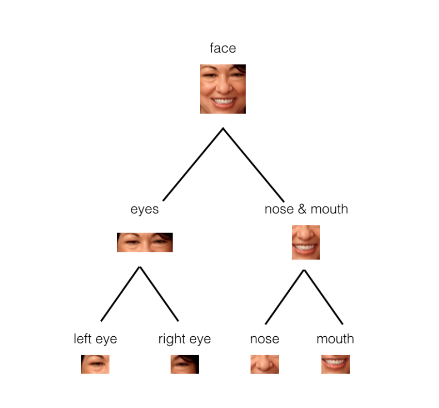
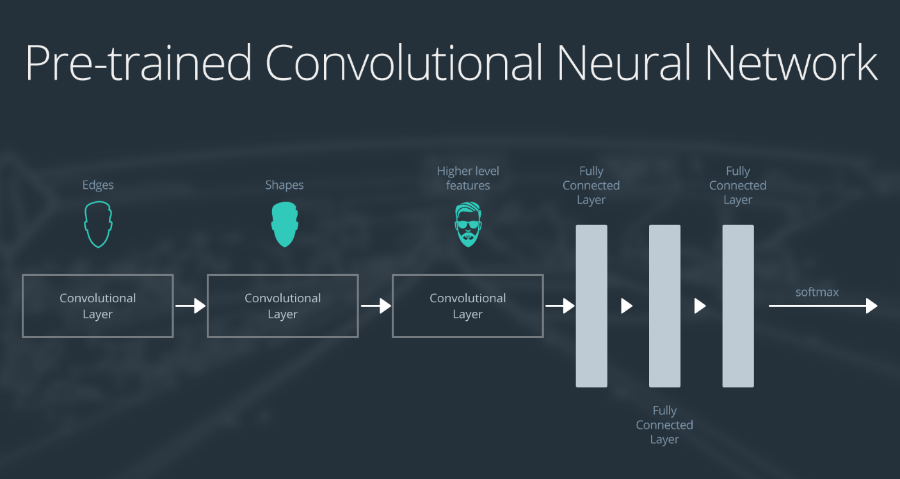
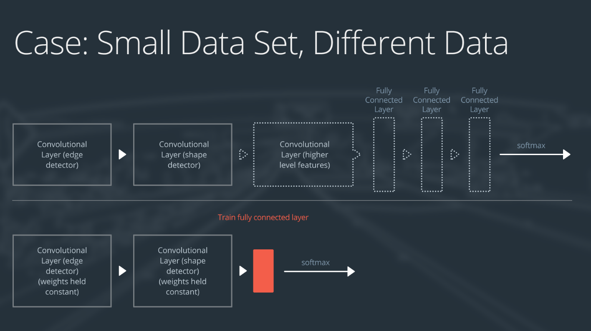
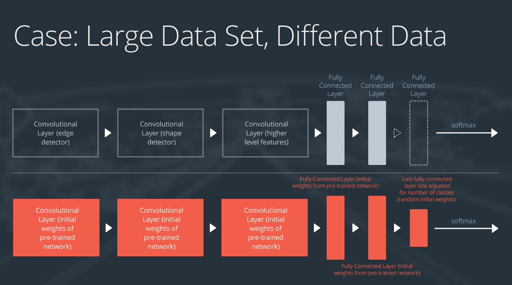

# Convolutional Neural Networks

## Convolutional Neural Networks

### Applications of CNNs

- Read about the [WaveNet](https://deepmind.com/blog/wavenet-generative-model-raw-audio/) model.
  - Why train an A.I. to talk, when you can train it to sing ;)? In April 2017, researchers used a variant of the WaveNet model to generate songs. The original paper and demo can be found [here](http://www.creativeai.net/posts/W2C3baXvf2yJSLbY6/a-neural-parametric-singing-synthesizer).
- Learn about CNNs for [text classification](http://www.wildml.com/2015/12/implementing-a-cnn-for-text-classification-in-tensorflow/).
  - You might like to sign up for the author's [Deep Learning Newsletter](https://www.getrevue.co/profile/wildml)!
- Read about Facebook's [novel CNN approach](https://code.facebook.com/posts/1978007565818999/a-novel-approach-to-neural-machine-translation/) for language translation that achieves state-of-the-art accuracy at nine times the speed of RNN models.
- Play [Atari](https://deepmind.com/research/dqn/) games with a CNN and reinforcement learning. You can [download](https://sites.google.com/a/deepmind.com/dqn/) the code that comes with this paper.
  - If you would like to play around with some beginner code (for deep reinforcement learning), you're encouraged to check out Andrej Karpathy's [post](http://karpathy.github.io/2016/05/31/rl/).
- Play [pictionary](https://quickdraw.withgoogle.com/#) with a CNN!
  - Also check out all of the other cool implementations on the [A.I. Experiments](https://aiexperiments.withgoogle.com/) website. Be sure not to miss [AutoDraw](https://www.autodraw.com/)!
- Read more about [AlphaGo](https://deepmind.com/research/alphago/).
  - Check out this [article](https://www.technologyreview.com/s/604273/finding-solace-in-defeat-by-artificial-intelligence/?set=604287), which asks the question: If mastering Go “requires human intuition,” what is it like to have a piece of one’s humanity challenged?
- Check out these really cool videos with drones that are powered by CNNs.
  - Here's an interview with a startup - [Intelligent Flying Machines (IFM)](https://www.youtube.com/watch?v=AMDiR61f86Y).
  - Outdoor autonomous navigation is typically accomplished through the use of the [global positioning system (GPS)](http://www.droneomega.com/gps-drone-navigation-works/), but here's a demo with a CNN-powered [autonomous drone](https://www.youtube.com/watch?v=wSFYOw4VIYY).
- If you're excited about using CNNs in self-driving cars, you're encouraged to check out:
  - our [Self-Driving Car Engineer Nanodegree](https://www.udacity.com/course/self-driving-car-engineer-nanodegree--nd013), where we classify signs in the [German Traffic Sign](http://benchmark.ini.rub.de/?section=gtsrb&subsection=dataset) dataset in [this project](https://github.com/udacity/CarND-Traffic-Sign-Classifier-Project).
  - our [Machine Learning Engineer Nanodegree](https://www.udacity.com/course/machine-learning-engineer-nanodegree--nd009), where we classify house numbers from the [Street View House Numbers](http://ufldl.stanford.edu/housenumbers/) dataset in [this project](https://github.com/udacity/machine-learning/tree/master/projects/digit_recognition).
  - this [series of blog posts](https://pythonprogramming.net/game-frames-open-cv-python-plays-gta-v/) that details how to train a CNN in Python to produce a self-driving A.I. to play Grand Theft Auto V.
- Check out some additional applications not mentioned in the video.
  - Some of the world's most famous paintings have been [turned into 3D](http://www.businessinsider.com/3d-printed-works-of-art-for-the-blind-2016-1) for the visually impaired. Although the article does not mention how this was done, we note that it is possible to use a CNN to [predict depth](https://www.cs.nyu.edu/~deigen/depth/) from a single image.
  - Check out [this research](https://research.googleblog.com/2017/03/assisting-pathologists-in-detecting.html) that uses CNNs to localize breast cancer.
  - CNNs are used to [save endangered species](https://blogs.nvidia.com/blog/2016/11/04/saving-endangered-species/?adbsc=social_20170303_70517416)!
  - An app called [FaceApp](http://www.digitaltrends.com/photography/faceapp-neural-net-image-editing/) uses a CNN to make you smile in a picture or change genders.

### Notebook: MLP Classification

To open this notebook, you have two options:

- Go to the next page in the classroom (recommended).
- Clone the repo from [Github](https://github.com/udacity/deep-learning-v2-pytorch) and open the notebook mnist_mlp_exercise.ipynb in the convolutional-neural-networks > mnist-mlp folder. You can either download the repository with `git clone https://github.com/udacity/deep-learning-v2-pytorch.git`, or download it as an archive file from [this link](https://github.com/udacity/deep-learning-v2-pytorch/archive/master.zip).

**Instructions**

- Define an MLP model for classifying MNIST images
- Train it for some number of epochs and test your model to see how well it generalizes and measure its accuracy.

This is a self-assessed lab. If you need any help or want to check your answers, feel free to check out the solutions notebook in the same folder, or by clicking [here](https://github.com/udacity/deep-learning-v2-pytorch/blob/master/convolutional-neural-networks/mnist-mlp/mnist_mlp_solution.ipynb).

### Frequency in images

We have an intuition of what frequency means when it comes to sound. High-frequency is a high pitched noise, like a bird chirp or violin. And low frequency sounds are low pitch, like a deep voice or a bass drum. For sound, frequency actually refers to how fast a sound wave is oscillating; oscillations are usually measured in cycles/s ([Hz](https://en.wikipedia.org/wiki/Hertz)), and high pitches and made by high-frequency waves. Examples of low and high-frequency sound waves are pictured below. On the y-axis is amplitude, which is a measure of sound pressure that corresponds to the perceived loudness of a sound, and on the x-axis is time.

**High and low frequency**

Similarly, frequency in images is a rate of change. But, what does it means for an image to change? Well, images change in space, and a high frequency image is one where the intensity changes a lot. And the level of brightness changes quickly from one pixel to the next. A low frequency image may be one that is relatively uniform in brightness or changes very slowly. This is easiest to see in an example.

Most images have both high-frequency and low-frequency components. In the image above, on the scarf and striped shirt, we have a high-frequency image pattern; this part changes very rapidly from one brightness to another. Higher up in this same image, we see parts of the sky and background that change very gradually, which is considered a smooth, low-frequency pattern.

High-frequency components also correspond to the edges of objects in images, which can help us classify those objects.

### OpenCV

OpenCV is a computer vision and machine learning software library that includes many common image analysis algorithms that will help us build custom, intelligent computer vision applications. To start with, this includes tools that help us process images and select areas of interest! The library is widely used in academic and industrial applications; from [their site](http://opencv.org/about.html), OpenCV includes an impressive list of users: “Along with well-established companies like Google, Yahoo, Microsoft, Intel, IBM, Sony, Honda, Toyota that employ the library, there are many startups such as Applied Minds, VideoSurf, and Zeitera, that make extensive use of OpenCV.”

So, note, how we `import cv2` in the next notebook and use it to create and apply image filters!

**Notebook: Custom Filters**

The next notebook is called `custom_filters.ipynb`.

To open the notebook, you have two options:

- Go to the next page in the classroom (recommended).
- Clone the repo from [Github](https://github.com/udacity/deep-learning-v2-pytorch) and open the notebook custom_filters.ipynb in the convolutional-neural-networks > conv-visualization folder. You can either download the repository with `git clone https://github.com/udacity/deep-learning-v2-pytorch.git`, or download it as an archive file from [this link](https://github.com/udacity/deep-learning-v2-pytorch/archive/master.zip).

**Instructions**

- Define your own convolutional filters and apply them to an image of a road
- See if you can define filters that detect horizontal or vertical edges

This notebook is meant to be a playground where you can try out different filter sizes and weights and see the resulting, filtered output image!

### Convolutional Layer

What you've just learned about different types of filters will be really important as you progress through this course, especially when you get to Convolutional Neural Networks (CNNs). CNNs are a kind of deep learning model that can learn to do things like image classification and object recognition. They keep track of spatial information and learn to extract features like the edges of objects in something called a convolutional layer. Below you'll see an simple CNN structure, made of multiple layers, below, including this "convolutional layer".

**Convolutional Layer**

The convolutional layer is produced by applying a series of many different image filters, also known as convolutional kernels, to an input image.

In the example shown, 4 different filters produce 4 differently filtered output images. When we stack these images, we form a complete convolutional layer with a depth of 4!

**Learning**

In the code you've been working with, you've been setting the values of filter weights explicitly, but neural networks will actually learn the best filter weights as they train on a set of image data. You'll learn all about this type of neural network later in this section, but know that high-pass and low-pass filters are what define the behavior of a network like this, and you know how to code those from scratch!

In practice, you'll also find that many neural networks learn to detect the edges of images because the edges of object contain valuable information about the shape of an object.

**Notebook**

The Jupyter notebook described in the video can be accessed from the `deep-learning-v2-pytorch` GitHub respository linked [here](https://github.com/udacity/deep-learning-v2-pytorch/tree/master/convolutional-neural-networks). Navigate to the conv-visualization/ folder and open conv_visualization.ipynb.

### Notebook: Layer Visualizations

The next notebooks are about visualizing the output of convolutional and pooling layers.

To open the notebook, you have two options:

- Go to the next page in the classroom (recommended).
- Clone the repo from [Github](https://github.com/udacity/deep-learning-v2-pytorch) and open the notebook conv_visualization.ipynb & maxpooling_visualization.ipynb in the convolutional-neural-networks > conv-visualization folder. You can either download the repository with `git clone https://github.com/udacity/deep-learning-v2-pytorch.git`, or download it as an archive file from [this link](https://github.com/udacity/deep-learning-v2-pytorch/archive/master.zip).

**Instructions**

This notebook is meant to give you a chance to explore the effect of convolutional layers, activations, and pooling layers!

### Capsule Networks

It's important to note that pooling operations do throw away some image information. That is, they discard pixel information in order to get a smaller, feature-level representation of an image. This works quite well in tasks like image classification, but it can cause some issues.

Consider the case of facial recognition. When you think of how you identify a face, you might think about noticing features; two eyes, a nose, and a mouth, for example. And those pieces, together, form a complete face! A typical CNN that is trained to do facial recognition, should also learn to identify these features. Only, by distilling an image into a feature-level representation, you might get a weird result:

- Given an image of a face that has been photoshopped to include three eyes or a nose placed above the eyes, a feature-level representation will identify these features and still recognize a face! Even though that face is fake/contains too many features in an atypical orientation.

So, there has been research into classification methods that do not discard spatial information (as in the pooling layers), and instead learn to spatial relationships between parts (like between eyes, nose, and mouth).

> One such method, for learning spatial relationships between parts, is the capsule network.

**Capsule Networks**

Capsule Networks provide a way to detect parts of objects in an image and represent spatial relationships between those parts. This means that capsule networks are able to recognize the same object, like a face, in a variety of different poses and with the typical number of features (eyes, nose , mouth) even if they have not seen that pose in training data.

Capsule networks are made of parent and child nodes that build up a complete picture of an object.

In the example above, you can see how the parts of a face (eyes, nose, mouth, etc.) might be recognized in leaf nodes and then combined to form a more complete face part in parent nodes.

**What are Capsules?**

Capsules are essentially a collection of nodes, each of which contains information about a specific part; part properties like width, orientation, color, and so on. The important thing to note is that each capsule outputs a vector with some magnitude and orientation.

- Magnitude (m) = the probability that a part exists; a value between 0 and 1.
- Orientation (theta) = the state of the part properties.
These output vectors allow us to do some powerful routing math to build up a parse tree that recognizes whole objects as comprised of several, smaller parts!

The magnitude is a special part property that should stay very high even when an object is in a different orientation, as shown below.

**Resources**

- You can learn more about [capsules, in this blog post](https://cezannec.github.io/Capsule_Networks/).
- And experiment with an implementation of a capsule network in PyTorch, [at this github repo](https://github.com/cezannec/capsule_net_pytorch).
- [Dynamic Routing Between Capsules](https://video.udacity-data.com/topher/2018/November/5bfdca4f_dynamic-routing/dynamic-routing.pdf)

### Notebook: CNNs in PyTorch

Now, you're ready to define and train an CNN in PyTorch.

To open this notebook, you have two options:

- Go to the next page in the classroom (recommended).
- Clone the repo from [Github](https://github.com/udacity/deep-learning-v2-pytorch) and open the notebook cifar10_cnn_exercise.ipynb in the convolutional-neural-networks > cifar-cnn folder. You can either download the repository with `git clone https://github.com/udacity/deep-learning-v2-pytorch.git`, or download it as an archive file from [this link](https://github.com/udacity/deep-learning-v2-pytorch/archive/master.zip).

**Instructions**

- Define a CNN model for classifying CIFAR10 images
- Train it for some number of epochs and test your model to see how well it generalizes and measure its accuracy.

This is a self-assessed lab. If you need any help or want to check your answers, feel free to check out the solutions notebook in the same folder, or by clicking [here](https://github.com/udacity/deep-learning-v2-pytorch/blob/master/convolutional-neural-networks/cifar-cnn/cifar10_cnn_solution.ipynb).

### Augmentation Using Transformations

You can take a look at the complete augmentation code in the previous notebook directory, or, directly in the [Github repository](https://github.com/udacity/deep-learning-v2-pytorch/blob/master/convolutional-neural-networks/cifar-cnn/cifar10_cnn_augmentation.ipynb).

### Groundbreaking CNN Architectures

- Check out the [AlexNet](http://papers.nips.cc/paper/4824-imagenet-classification-with-deep-convolutional-neural-networks.pdf) paper!
- Read more about [VGGNet](https://arxiv.org/pdf/1409.1556.pdf) here.
- The [ResNet](https://arxiv.org/pdf/1512.03385v1.pdf) paper can be found here.
- Here's the Keras [documentation](https://keras.io/applications/) for accessing some famous CNN architectures.
- Read this [detailed treatment](http://neuralnetworksanddeeplearning.com/chap5.html) of the vanishing gradients problem.
- Here's a [GitHub repository](https://github.com/jcjohnson/cnn-benchmarks) containing benchmarks for different CNN architectures.
- Visit the [ImageNet Large Scale Visual Recognition Competition (ILSVRC)](http://www.image-net.org/challenges/LSVRC/) website.

### Visualizing CNNs

- Here's a [section](http://cs231n.github.io/understanding-cnn/) from the Stanford's CS231n course on visualizing what CNNs learn.
- Check out this [demonstration](https://aiexperiments.withgoogle.com/what-neural-nets-see) of a cool [OpenFrameworks](http://openframeworks.cc/) app that visualizes CNNs in real-time, from user-supplied video!
- Here's a [demonstration](https://www.youtube.com/watch?v=AgkfIQ4IGaM&t=78s) of another visualization tool for CNNs. If you'd like to learn more about how these visualizations are made, check out this [video](https://www.youtube.com/watch?v=ghEmQSxT6tw&t=5s).
- Read this [Keras blog post](https://blog.keras.io/how-convolutional-neural-networks-see-the-world.html) on visualizing how CNNs see the world. In this post, you can find an accessible introduction to Deep Dreams, along with code for writing your own deep dreams in Keras. When you've read that:
  - Also check out this [music video](https://www.youtube.com/watch?v=XatXy6ZhKZw) that makes use of Deep Dreams (look at 3:15-3:40)!
  - Create your own Deep Dreams (without writing any code!) using this [website](https://www.youtube.com/watch?v=XatXy6ZhKZw).
- If you'd like to read more about interpretability of CNNs:
  - Here's an [article](https://blog.openai.com/adversarial-example-research/) that details some dangers from using deep learning models (that are not yet interpretable) in real-world applications.
  - There's a lot of active research in this area. [These authors](https://arxiv.org/abs/1611.03530) recently made a step in the right direction.

## Transfer Learning

### Fine-Tuning

Transfer learning involves taking a pre-trained neural network and adapting the neural network to a new, different data set.

Depending on both:

- The size of the new data set, and
- The similarity of the new data set to the original data set

The approach for using transfer learning will be different. There are four main cases:
- New data set is small, new data is similar to original training data.
- New data set is small, new data is different from original training data.
- New data set is large, new data is similar to original training data.
- New data set is large, new data is different from original training data.

A large data set might have one million images. A small data could have two-thousand images. The dividing line between a large data set and small data set is somewhat subjective. Overfitting is a concern when using transfer learning with a small data set.

Images of dogs and images of wolves would be considered similar; the images would share common characteristics. A data set of flower images would be different from a data set of dog images.

Each of the four transfer learning cases has its own approach. In the following sections, we will look at each case one by one.

The graph below displays what approach is recommended for each of the four main cases.

**Demonstration Network**

To explain how each situation works, we will start with a generic pre-trained convolutional neural network and explain how to adjust the network for each case. Our example network contains three convolutional layers and three fully connected layers:

Here is an generalized overview of what the convolutional neural network does:

- the first layer will detect edges in the image
- the second layer will detect shapes
- the third convolutional layer detects higher level features

Each transfer learning case will use the pre-trained convolutional neural network in a different way.

**Case 1: Small Data Set, Similar Data**

If the new data set is small and similar to the original training data:

- slice off the end of the neural network
- add a new fully connected layer that matches the number of classes in the new data set
- randomize the weights of the new fully connected layer; freeze all the weights from the pre-trained network
- train the network to update the weights of the new fully connected layer

To avoid overfitting on the small data set, the weights of the original network will be held constant rather than re-training the weights.

Since the data sets are similar, images from each data set will have similar higher level features. Therefore most or all of the pre-trained neural network layers already contain relevant information about the new data set and should be kept.

Here's how to visualize this approach:

**Case 2: Small Data Set, Different Data**

If the new data set is small and different from the original training data:

- slice off all but some of the pre-trained layers near the beginning of the network
- add to the remaining pre-trained layers a new fully connected layer that matches the number of classes in the new data set
- randomize the weights of the new fully connected layer; freeze all the weights from the pre-trained network
- train the network to update the weights of the new fully connected layer

Because the data set is small, overfitting is still a concern. To combat overfitting, the weights of the original neural network will be held constant, like in the first case.

But the original training set and the new data set do not share higher level features. In this case, the new network will only use the layers containing lower level features.

Here is how to visualize this approach:

**Case 3: Large Data Set, Similar Data**

If the new data set is large and similar to the original training data:

- remove the last fully connected layer and replace with a layer matching the number of classes in the new data set
- randomly initialize the weights in the new fully connected layer
- initialize the rest of the weights using the pre-trained weights
- re-train the entire neural network

Overfitting is not as much of a concern when training on a large data set; therefore, you can re-train all of the weights.

Because the original training set and the new data set share higher level features, the entire neural network is used as well.

Here is how to visualize this approach:

**Case 4: Large Data Set, Different Data**

If the new data set is large and different from the original training data:

- remove the last fully connected layer and replace with a layer matching the number of classes in the new data set
- retrain the network from scratch with randomly initialized weights
- alternatively, you could just use the same strategy as the "large and similar" data case

Even though the data set is different from the training data, initializing the weights from the pre-trained network might make training faster. So this case is exactly the same as the case with a large, similar data set.

If using the pre-trained network as a starting point does not produce a successful model, another option is to randomly initialize the convolutional neural network weights and train the network from scratch.

Here is how to visualize this approach:

**Optional Resources**

- Check out this [research paper](https://arxiv.org/pdf/1411.1792.pdf) that systematically analyzes the transferability of features learned in pre-trained CNNs.
- Read the [Nature publication](http://www.nature.com/articles/nature21056.epdf?referrer_access_token=_snzJ5POVSgpHutcNN4lEtRgN0jAjWel9jnR3ZoTv0NXpMHRAJy8Qn10ys2O4tuP9jVts1q2g1KBbk3Pd3AelZ36FalmvJLxw1ypYW0UxU7iShiMp86DmQ5Sh3wOBhXDm9idRXzicpVoBBhnUsXHzVUdYCPiVV0Slqf-Q25Ntb1SX_HAv3aFVSRgPbogozIHYQE3zSkyIghcAppAjrIkw1HtSwMvZ1PXrt6fVYXt-dvwXKEtdCN8qEHg0vbfl4_m&tracking_referrer=edition.cnn.com) detailing Sebastian Thrun's cancer-detecting CNN!

### Notebook: Transfer Learning

To open this notebook, you have two options:

- Go to the next page in the classroom (recommended).
- Clone the repo from [Github](https://github.com/udacity/deep-learning-v2-pytorch) and open the notebook Transfer_Learning_Exercise.ipynb in the transfer-learning folder. You can either download the repository with `git clone https://github.com/udacity/deep-learning-v2-pytorch.git`, or download it as an archive file from [this link](https://github.com/udacity/deep-learning-v2-pytorch/archive/master.zip).

**Instructions**

- Load in a pre-trained VGG Net
- Freeze the weights in selected layers and add a new, linear layer of your own design
- Train the modified model for a couple epochs and test its performance

This is a self-assessed lab. If you need any help or want to check your answers, feel free to check out the solutions notebook in the same folder, or by clicking [here](https://github.com/udacity/deep-learning-v2-pytorch/blob/master/transfer-learning/Transfer_Learning_Solution.ipynb).

## Weight Initialization

### Notebook: Weight Initialization

To open this notebook, you have two options:

- Go to the next page in the classroom (recommended).
- Clone the repo from [Github](https://github.com/udacity/deep-learning-v2-pytorch) and open the notebook weight_initialization_exercise.ipynb in the *weight-initialization folder. You can either download the repository with `git clone https://github.com/udacity/deep-learning-v2-pytorch.git`, or download it as an archive file from [this link](https://github.com/udacity/deep-learning-v2-pytorch/archive/master.zip).

**Instructions**

- Load in the FashionMNIST data
- Define a function to initialize the weights of your model, taking values from a normal distribution
- See how a model without any explicit weight initialization performs

This is a self-assessed lab. If you need any help or want to check your answers, feel free to check out the solutions notebook in the same folder, or by clicking [here](https://github.com/udacity/deep-learning-v2-pytorch/blob/master/weight-initialization/weight_initialization_solution.ipynb).

### Additional Materials

New techniques for dealing with weights are discovered every few years. We've provided the most popular papers in this field over the years.

- [Understanding the difficulty of training deep feedforward neural networks](http://jmlr.org/proceedings/papers/v9/glorot10a/glorot10a.pdf)
- [Delving Deep into Rectifiers: Surpassing Human-Level Performance on ImageNet Classification](https://arxiv.org/pdf/1502.01852v1.pdf)
- [Batch Normalization: Accelerating Deep Network Training by Reducing Internal Covariate Shift](https://arxiv.org/pdf/1502.03167v2.pdf)

## Autoencoders

### Notebook: Linear Autoencoder

To open this notebook, you have two options:

- Go to the next page in the classroom (recommended).
- Clone the repo from [Github](https://github.com/udacity/deep-learning-v2-pytorch) and open the notebook Simple_Autoencoder_Exercise.ipynb in the autoencoder > linear-autoencoder folder. You can either download the repository with `git clone https://github.com/udacity/deep-learning-v2-pytorch.git`, or download it as an archive file from [this link](https://github.com/udacity/deep-learning-v2-pytorch/archive/master.zip).

**Instructions**

- Define and train a linear autoencoder

This is a self-assessed lab. If you need any help or want to check your answers, feel free to check out the solutions notebook in the same folder, or by clicking [here](https://github.com/udacity/deep-learning-v2-pytorch/blob/master/autoencoder/linear-autoencoder/Simple_Autoencoder_Solution.ipynb).

### Notebook: Convolutional Autoencoder

To open this notebook, you have two options:

- Go to the next page in the classroom (recommended).
- Clone the repo from [Github](https://github.com/udacity/deep-learning-v2-pytorch) and open the notebook Convolutional_Autoencoder_Exercise.ipynb in the autoencoder > convolutional-autoencoder folder. You can either download the repository with `git clone https://github.com/udacity/deep-learning-v2-pytorch.git`, or download it as an archive file from [this link](https://github.com/udacity/deep-learning-v2-pytorch/archive/master.zip).

**Instructions**

- Define and train a convolutional autoencoder

This is a self-assessed lab. If you need any help or want to check your answers, feel free to check out the solutions notebook in the same folder, or by clicking [here](https://github.com/udacity/deep-learning-v2-pytorch/blob/master/autoencoder/convolutional-autoencoder/Convolutional_Autoencoder_Solution.ipynb).

### Notebook: De-noising Autoencoder

Try defining and training an autoencoder for denoising images!

To open this notebook, you have two options:

- Go to the next page in the classroom (recommended).
- Clone the repo from [Github](https://github.com/udacity/deep-learning-v2-pytorch) and open the notebook Denoising_Autoencoder_Exercise.ipynb in the autoencoder > denoising-autoencoder folder. You can either download the repository with `git clone https://github.com/udacity/deep-learning-v2-pytorch.git`, or download it as an archive file from [this link](https://github.com/udacity/deep-learning-v2-pytorch/archive/master.zip).

**Instructions**

- Define and train a convolutional autoencoder
- Add more/deeper layers to create a successful de-noiser

This is a self-assessed lab. If you need any help or want to check your answers, feel free to check out one kind of solution in the following notebook, or by clicking [here](https://github.com/udacity/deep-learning-v2-pytorch/blob/master/autoencoder/denoising-autoencoder/Denoising_Autoencoder_Solution.ipynb).