# Machine Learning in Production

## Introduction to Deployment

### What's Ahead?

In this lesson, you're going to get familiar with what's meant by machine learning deployment. Then in the upcoming lessons, you will put these ideas to practice by using [Amazon's SageMaker](https://aws.amazon.com/sagemaker/). SageMaker is just one method for deploying machine learning models.

Specifically in this lesson, we will look at answering the following questions:

1. What's the machine learning workflow?

2. How does deployment fit into the machine learning workflow?

3. What is cloud computing?

4. Why would we use cloud computing for deploying machine learning models?

5. Why isn't deployment a part of many machine learning curriculums?

6. What does it mean for a model to be deployed?

7. What are the essential characteristics associated with the code of deployed models?

8. What are different cloud computing platforms we might use to deploy our machine learning models?

At the end of this lesson, you'll understand the broader idea of machine learning deployment. Then Sean will be guiding you through using SageMaker to deploy your own machine learning models. This is a lot to cover, but by the end you will have a general idea of all the concepts related to deploying machine learning models into real world production systems.

### Machine Learning Workflow

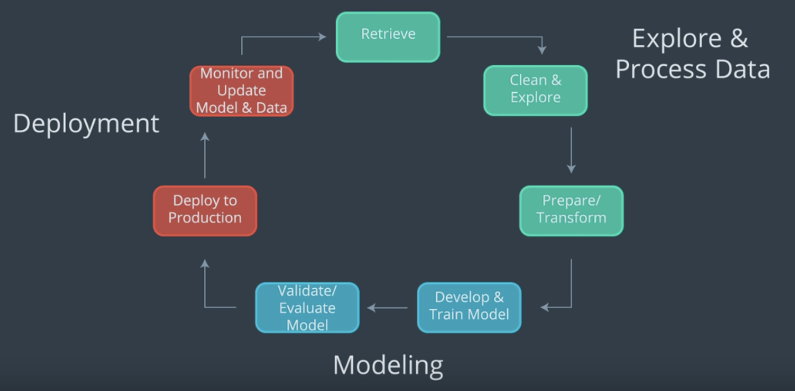

- References
  - [Amazon Web Services](https://aws.amazon.com/) (AWS) discusses their definition of the [Machine Learning Workflow](https://docs.aws.amazon.com/sagemaker/latest/dg/how-it-works-mlconcepts.html).
  - [Google Cloud Platform](https://cloud.google.com/) (GCP) discusses their definition of the [Machine Learning Workflow](https://cloud.google.com/ml-engine/docs/tensorflow/ml-solutions-overview).
  - [Microsoft Azure](https://azure.microsoft.com/en-us/) (Azure) discusses their definition of the [Machine Learning Workflow](https://docs.microsoft.com/en-us/azure/machine-learning/service/overview-what-is-azure-ml).

### Cloud Computing

In this section, we will focus on answering two questions:

- What is cloud computing?
- Why would a business decide to use cloud computing?

#### What is cloud computing?

You can think of cloud computing as transforming an IT product into an IT service.

Consider the following example:

Have you ever had to backup and store important files on your computer? Maybe these files are family photos from your last vacation. You might store these photos on a flash drive. These days you have an alternative option to store these photos in the cloud using a cloud storage provider, like: Google Drive, Apple’s iCloud, or Microsoft’s OneDrive.

Cloud computing can simply be thought of as transforming an Information Technology (IT) product into a service. With our vacation photos example, we transformed storing photos on an IT product, the flash drive; into storing them using a service, like Google Drive.

Using a cloud storage service provides the benefits of making it easier to access and share your vacation photos, because you no longer need the flash drive. You’ll only need a device with an internet connection to access your photos and to grant permission to others to access your photos.

Generally, think of cloud computing as using an internet connected device to log into a cloud computing service, like Google Drive, to access an IT resource, your vacation photos. These IT resources, your vacation photos, are stored in the cloud provider’s data center. Besides cloud storage, other cloud services include: cloud applications, databases, virtual machines, and other services like SageMaker.

#### Why would a business decide to use cloud computing?

Most of the factors related to choosing cloud computing services, instead of developing on-premise IT resources are related to time and cost. The capacity utilization graph below shows how cloud computing compares to traditional infrastructure (on-premise IT resources) in meeting customer demand.

Capacity in the graph below can be thought of as the IT resources like: compute capacity, storage, and networking, that's needed to meet customer demand for a business' products and the costs associated with those IT resources. In our vacation photos example, customer demand is for storing and sharing customer photos. The IT resources are the required software and hardware that enables photo storage and sharing in the cloud or on-premise (traditional infrastructure).

Looking at the graph, notice that traditional infrastructure doesn't scale when there are spikes in demand, and also leaves excess when preparing for future demand. This ability to easily meet unstable, fluctuating customer demand illustrates many of the benefits of cloud computing.


#### Summary of Benefits of Risks Associated with Cloud Computing

The capacity utilization graph above was initially used by cloud providers like Amazon to illustrate the benefits of cloud computing. Summarized below are the benefits of cloud computing that are often what drives businesses to include cloud services in their IT infrastructure [1]. These same benefits are echoed in those provided by cloud providers Amazon ([benefits](https://aws.amazon.com/what-is-cloud-computing/)), Google ([benefits](https://cloud.google.com/what-is-cloud-computing/)), and Microsoft ([benefits](https://azure.microsoft.com/en-us/overview/what-is-cloud-computing/)).

Benefits
- Reduced Investments and Proportional Costs (providing cost reduction)
- Increased Scalability (providing simplified capacity planning)
- Increased Availability and Reliability (providing organizational agility)

Below we have also summarized he risks associated with cloud computing [1]. Cloud providers don't typically highlight the risks assumed when using their cloud services like they do with the benefits, but cloud providers like: Amazon ([security](https://aws.amazon.com/security/introduction-to-cloud-security/)), Google ([security](https://cloud.google.com/security/data-safety/)), and Microsoft ([security](https://www.microsoft.com/en-us/TrustCenter/CloudServices/Azure/default.aspx)) often provide details on security of their cloud services. It's up to the cloud user to understand the compliance and legal issues associated with housing data within a cloud provider's data center instead of on-premise. The service level agreements (SLA) provided for a cloud service often highlight security responsibilities of the cloud provider and those assumed by the cloud user.

Risks
- (Potential) Increase in Security Vulnerabilities
- Reduced Operational Governance Control (over cloud resources)
- Limited Portability Between Cloud Providers
- Multi-regional Compliance and Legal Issues

References
1. Erl, T., Mahmood, Z., & Puttini R,. (2013). Cloud Computing: Concepts, Technology, & Architecture. Upper Saddle River, NJ: Prentice Hall. Chapter 3: Understanding Cloud Computing provides an outline of the business drivers, benefits and risks of cloud computing.

**Additional Resources**

For the purpose of deploying machine learning models, it's important to understand the basics of cloud computing.

- [National Institute of Standards and Technology](https://www.nist.gov/) formal definition of [Cloud Computing](https://csrc.nist.gov/publications/detail/sp/800-145/final).
- Kavis, M. (2014). Architecting the Cloud: Design Decisions for Cloud Computing Service Models. Hoboken, NJ: Wiley. Chapter 3 provides the worst practices of cloud computing which highlights both risks and benefits of cloud computing. Chapter 9 provides the security responsibilities by service model.
- Amazon Web Services (AWS) discusses their definition of [Cloud Computing](https://aws.amazon.com/what-is-cloud-computing/).
- Google Cloud Platform (GCP) discusses their definition of [Cloud Computing](https://cloud.google.com/what-is-cloud-computing/).
- Microsoft Azure (Azure) discusses their definition of [Cloud Computing](https://azure.microsoft.com/en-us/overview/what-is-cloud-computing/).

### [Optional] Cloud Computing Defined

#### Cloud Computing Defined by Cloud Providers and References

Cloud computing was first formally defined by the National Institute of Standards and Technology (NIST) using service models, deployment models, and essential characteristics (see 1 in References). Using this formal definition, authors Thomas Erl and Michael Kavis explained in more detail cloud computing, its service models, its deployment models, and its essential characteristics in their books (see 2 & 3 in References). Cloud providers Amazon, Google, and Microsoft also provide more modern and evolving explanations of cloud computing, its service models, its deployment models, and its essential characteristics (see 4, 5, & 6 in References). The information found in this section is based upon the materials that we have included in the References at the end of this section.

#### Defining Cloud Computing

**Recall the Cloud Computing Example**

Where we stored our vacation photos in the cloud using a cloud storage provider, like: Google Drive, Apple’s iCloud, or Microsoft’s OneDrive, instead of storing them on a flash drive.

With this example, we demonstrated that cloud computing can simply be thought of as transforming an Information Technology (IT) product into a service. With our vacation photos example, we transformed storing photos on an IT product, the flash drive; into storing them using a service, like Google Drive.

The vacation photo example illustrates how cloud storage service provides the benefits of making it easier to access and share our photos. In general, most of the factors related to choosing cloud computing services, instead of developing on-premise IT resources are associated with benefits related to time and cost.

Below we will explain in detail the formal definition of cloud computing.


In 2011, the National Institute of Standards and Technology (NIST) defined cloud computing using service models, deployment models, and essential characteristics.

While you have already learned that cloud computing is thought of as transforming an IT product, a flash drive, into a cloud service, Google Drive; next we take a more detailed look at cloud computing.

#### Service Models of Cloud Computing

Let’s begin by discussing the three service models of cloud computing.

**Software as a Service**

Starting with Software as a Service, SaaS, we’ll use the following graphic to depict the components that compose each of the three service models. The graphic shows whose responsibility it is to create, customize, and maintain the components. The yellow dashed line in the graphic shows with SaaS, the only customer responsibilities are those attributed to a “user” of the service and all other responsibilities are placed upon the cloud provider.


Software as a product is becoming more rare these days. It used to be that productivity software, like Microsoft Office, was loaded from a physical CD; now you can use applications like Google docs to write, edit, share, and store documents using cloud infrastructure.

Google docs is one example of Software as a Service. Some other examples of SaaS are email applications like gmail and hotmail, and storage applications like iCloud or OneDrive.

With SaaS, a cloud provider’s application that’s running on cloud infrastructure is provided to customers as a service. The customer’s responsibility is only to maintain their user account which typically includes: registration, login, administration, and customization of the software application they’re using as a service.

**Platform as a Service**

With Platform as a Service, PaaS, the yellow dashed line demonstrates that the customer gains additional responsibilities that are associated with managing all applications and data, such as including a user interface and dashboard, security, logs, and other features associated to the data and applications.


Some examples of Platform as a Service, are Heroku and Engine Yard. These services allow users to easily build, host, monitor, and scale their applications using their platform. For example, you might use Heroku to build and host an e-commerce website. Google’s App Engine is a similar PaaS for application development and deployment. The creator of “Angry Birds”, Rovio, used Google App Engine to create an online versions of their game.

With PaaS, the service provided to the customer is the ability to deploy customer-created or customer-acquired applications using the cloud provider’s platform. If you are interested in learning more about Rovio’s story using the Platform as a Service, Google App Engine, click on the following [link](https://cloud.google.com/customers/rovio/).

**Infrastructure as a Service**

With the service model Infrastructure as a Service, IaaS, as shown with the yellow dashed line; the customer has most of the responsibility beyond those associated with running secure data centers and maintaining the hardware and software that enables IaaS.


Some examples of IaaS are Amazon Web Services and Rackspace, which were among the first to offer Infrastructure as a Service that allowed their customers to use virtual machines.

Essentially a virtual machine is similar to a laptop or desktop computer, except it’s offered as a cloud service; requiring the user to login to their virtual machine through an internet connection.

IaaS enables the customer to provisioning computer processing, storage, networks, and other fundamental computing resources, where the consumer can deploy and run software using the provider’s cloud infrastructure.

Although Amazon, Microsoft, and Google all offer IaaS, they also offer other services that fall within the services models Platform and Software "-as-a-service". While you’re likely using “software-as-a-service” for your email, now that you understand the service models, consider expanding your usage of cloud to platform and infrastructure “as-a-service”.

**Service Models Importance**

All three service models provide access to greater computing capability and resources for an affordable price.
With Google App engine you could build the next popular online game, like Angry Birds, or use Amazon’s Virtual Machine service to have access to a more powerful computer instead of upgrading your own.

#### Deployment Models of Cloud Computing

Different levels of security are automatically provided with each deployment model. Understanding deployment models are important in providing the appropriate level of security on the cloud services you use. The primary way to distinguish between different deployment models is by the group that’s provisioning the cloud services. With provisioning, we simply mean the group that’s providing the cloud services for their group’s use.

**Public Cloud**

Most cloud deployment models offered by cloud providers, like Amazon Web Service or Google Cloud Platform, are public clouds. Public clouds are provisioned for use by the general public and they are the least secure of the deployment models. Because public clouds are the least secure, most providers allow customers to enable features that provide a “virtual private cloud” to increase the security on their public clouds.

**Community Cloud**

Amazon Web Services’ GovCloud is an example of a community cloud. GovCloud customers are limited to US federal government employees, contractors, and agencies that have been granted access. Community clouds are more secure than public clouds because providers limiting access to community members and they isolate computing resources used by the community. A community cloud deployment model is provisioned by a specific community of customers from different organizations that have shared interests, like the US federal government in our GovCloud example. Shared interests may include a shared mission, security requirements, policies, and/or compliance considerations.

**Private and Hybrid Clouds**

Private cloud deployment model is provisioned for exclusive use by a single organization. Amazon Web Services offers a Virtual Private Cloud service, but this isn’t considered truly a private cloud unless customers enable additional features that isolate the hardware their cloud services are run on. A private cloud can be physically located on a company’s on-site data center or on a cloud provider’s data center. If the private cloud is provided by a cloud provider, then the private cloud services and infrastructure are always maintained on a private network with hardware and software dedicated solely to the customer’s organization. The hybrid clouds are simply composed of two or three of the different types of deployment model.

#### Essential Characteristics of Cloud Computing

As we discuss these essential characteristics, keep in mind our example of uploading a file, like the vacation photos, to a cloud storage service, like Google Drive. These essential characteristics just define aspects of the path your file travels from your laptop to the cloud provider’s data center.

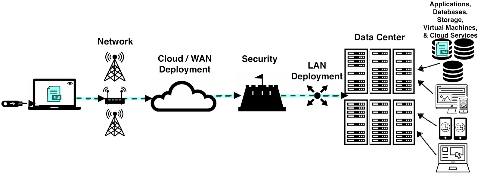

**On-Demand Self Service**

The essential characteristic on-demand self service means that a customer must be able to automatically provision computing capabilities from the cloud provider without requiring human interaction from the provider. Using our example of cloud storage, on-demand self service is characterized by the ability to log into the cloud storage service and upload, download, or delete the files you have stored within the service at any time without requiring a cloud provider employee to help with these activities.

**Broad Network Access**

Broad Network Access means that the computing capabilities are made available over the network accessed through standard mechanisms. Your smartphone, tablet, computer use this broad network access to allow you to work remotely, check social media, reply to an email, and generally access the internet. With our example of cloud storage, Broad Network Access is characterized by the ability to access the files you have stored with the cloud provider using any device that is connected to the internet. Noting that the cloud provider is responsible to ensure the path between the network and the data center.

**Resource Pooling**

Resource Pooling allows the cloud provider’s computing capabilities to be pooled to serve multiple customers with different virtual resources that are dynamically assigned and re-assigned based upon customer demand. Using our example of cloud storage, Resource Pooling enables the cloud provider to supply storage services to many customers using their data center to store all their customers’ files. Additionally, the provider’s storage service must be able to handle any customer storing one to many files.

**Rapid Elasticity**

Rapid Elasticity enables the cloud provider’s computing capabilities to be elastically provisioned and released to scale rapidly outward and inward proportional to customer demand. This ability to scale rapidly allows the cloud services to appear to have unlimited capabilities that can be used at any time for any quantity of demand. With our example of cloud storage, Rapid Elasticity provides the customer with the ability to store as many or as few files at any time.

**Measured Service**

Measured Service allows the cloud provider’s system to automatically control and optimize resource usage by leveraging the system’s metering capability. Specifically, the cloud provider’s resource usage can be monitored, controlled, and reported, which provides the necessary transparency for appropriately billing customers for cloud service usage. Using our example of cloud storage, Measured Service enables the cloud provider to charge a customer appropriately for storage space they are using to store their files.

**References**

Below are links and books that provide more detailed information on the topics discussed in this section above.

1. NIST formal definition of Cloud Computing is found [here](https://csrc.nist.gov/publications/detail/sp/800-145/final).
2. Erl, T., Mahmood, Z., & Puttini R. (2013). Cloud Computing: Concepts, Technology, & Architecture. Upper Saddle River, NJ: Prentice Hall.
  - Chapter 4: Discusses Cloud Computing Service Models, Deployment Models, and Essential Characteristics.
  - Chapter 5: Discusses some Cloud enabling technologies in more detail.
3. Kavis, M. (2014). Architecting the Cloud: Design Decisions for Cloud Computing Service Models. Hoboken, NJ: Wiley.
  - Chapter 2: Discusses Cloud Computing Service and Deployment Models.
  - Chapter 5: Discusses how to choose the right Service Model.
  - Chapter 9: Discusses security responsibilities by Service Model.
4. Amazon Web Services (AWS) discusses their definition of [Cloud Computing](https://aws.amazon.com/what-is-cloud-computing/), [Cloud Solutions by Application](https://aws.amazon.com/solutions/), and [Service & Deployment Models](https://aws.amazon.com/types-of-cloud-computing/).
5. Google Cloud Platform (GCP) discusses their definition of Cloud Computing and it's benefits [here](https://cloud.google.com/what-is-cloud-computing/).
6. Microsoft Azure (Azure) discusses their definition of Cloud Computing and it's service and deployment models [here](https://azure.microsoft.com/en-us/overview/what-is-cloud-computing/).

### Machine Learning Applications

All algorithms used within the machine learning workflow are similar for both the cloud and on-premise computing. The only real difference may be in the user interface and libraries that will be used to execute the machine learning workflow.

For personal use, one’s likely to use cloud services, if they don’t have enough computing capacity.

With academic use, quite often one will use the university’s on-premise computing resources, given their availability. For smaller universities or research groups with few funding resources, cloud services might offer a viable alternative to university computing resources.

For workplace usage, the amount of cloud resources used depends upon an organization’s existing infrastructure and their vulnerability to the risks of cloud computing. A workplace may have security concerns, operational governance concerns, and/or compliance and legal concerns regarding cloud usage. Additionally, a workplace may already have on-premise infrastructure that supports the workflow; therefore, making cloud usage an unnecessary expenditure. Keep in mind, many progressive companies may be incorporating cloud computing into their business due to the business drivers and benefits of cloud computing.

### Paths to Deployment

**Deployment to Production**

Deployment to production can simply be thought of as a method that integrates a machine learning model into an existing production environment so that the model can be used to make decisions or predictions based upon data input into the model.

This means that moving from modeling to deployment, a model needs to be provided to those responsible for deployment. We are going to assume that the machine learning model we will be deploying was developed in Python.

**Paths to Deployment**

There are three primary methods used to transfer a model from the modeling component to the deployment component of the machine learning workflow. We will be discussing them in order of least to most commonly used. The third method that's most similar to what’s used for deployment within Amazon’s SageMaker.

- Python model is recoded into the programming language of the production environment.
  - The first method which involves recoding the Python model into the language of the production environment, often Java or C++. This method is rarely used anymore because it takes time to recode, test, and validate the model that provides the same predictions as the original.
- Model is coded in Predictive Model Markup Language (PMML) or Portable Format Analytics (PFA).
  - The second method is to code the model in Predictive Model Markup Language (PMML) or Portable Format for Analytics (PFA), which are two complementary standards that simplify moving predictive models to deployment into a production environment. [The Data Mining Group](http://dmg.org/) developed both PMML and PFA to provide vendor-neutral executable model specifications for certain predictive models used by data mining and machine learning. Certain analytic software allows for the direct import of PMML including but not limited to IBM SPSS, R, SAS Base & Enterprise Miner, Apache Spark, Teradata Warehouse Miner, and TIBCO Spotfire.
- Python model is converted into a format that can be used in the production environment.
  - The third method is to build a Python model and use libraries and methods that convert the model into code that can be used in the production environment. Specifically most popular machine learning software frameworks, like PyTorch, TensorFlow, SciKit-Learn, have methods that will convert Python models into intermediate standard format, like ONNX ([Open Neural Network Exchange](https://onnx.ai/) format). This intermediate standard format then can be converted into the software native to the production environment.
    - This is the easiest and fastest way to move a Python model from modeling directly to deployment.
    - Moving forward this is typically the way models are moved into the production environment.
    - Technologies like containers, endpoints, and APIs (Application Programming Interfaces) also help ease the work required for deploying a model into the production environment. We will discuss these technologies in more detail in the next sections.

**Machine Learning Workflow and DevOps**

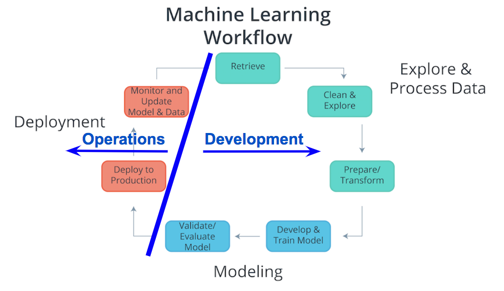

**Machine Learning Workflow and Deployment**

Considering the components of the Machine Learning Workflow, one can see how Exploring and Processing Data is tightly coupled with Modeling. The modeling can’t occur without first having the data the model will be based upon prepared for the modeling process.

Comparatively deployment is more tightly coupled with the production environment than with modeling or exploring and processing the data. Therefore, traditionally there’s was a separation between Deployment and the other components of the machine learning workflow. Specifically looking at the diagram above, the Process Data and Modeling are considered Development; whereas, Deployment is typically considered Operations.

In the past typically, development was handled by analysts; whereas, operations was handled by software developers responsible for the production environment. With recent developments in technology (containers, endpoints, APIs) and the most common path of deployment; this division between development and operations softens. The softening of this division enables analysts to handle certain aspects of deployment and enables faster updates to faltering models.

**Deployment within Machine Learning Curriculum**

Deployment is not commonly included in machine learning curriculum. This likely is associated with the analyst's typical focus on Exploring and Processing Data and Modeling, and the software developer's focusing more on Deployment and the production environment. Advances in cloud services, like SageMaker and ML Engine, and deployment technologies, like Containers and REST APIs, allow for analysts to easily take on the responsibilities of deployment.

### Production Environments

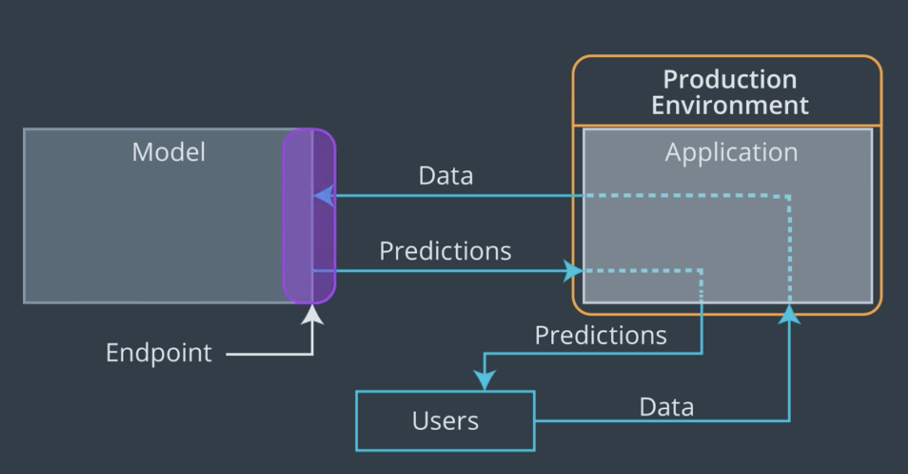

#### Endpoints

When we discussed the production environment, the endpoint was defined as the interface to the model. This interface (endpoint) facilitates an ease of communication between the model and the application. Specifically, this interface (endpoint)

- Allows the application to send user data to the model and
- Receives predictions back from the model based upon that user data.

**Model, Application, and Endpoint**

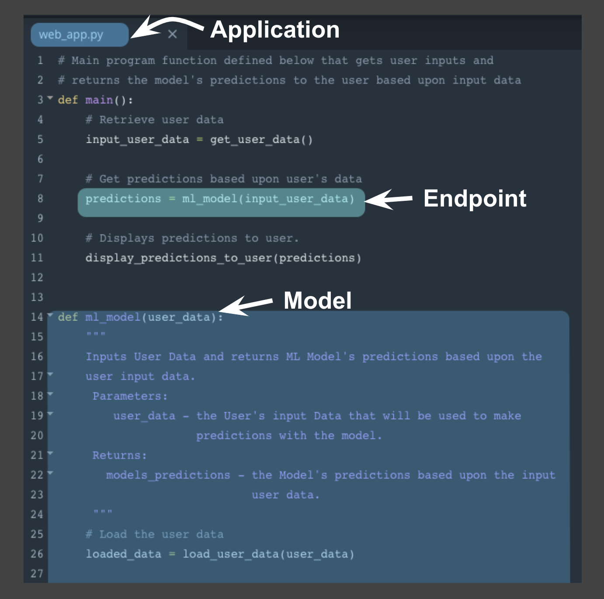

One way to think of the endpoint that acts as this interface, is to think of a Python program where:

- the endpoint itself is like a function call
- the function itself would be the model and
- the Python program is the application.

The image above depicts the association between a Python program and the endpoint, model, and application.

- the endpoint: line 8 function call to ml_model
- the model: beginning on line 14 function definition for ml_model
- the application: Python program web_app.py


Using this example above notice the following:

- Similar to a function call the endpoint accepts user data as the input and returns the model’s prediction based upon this input through the endpoint.
- In the example, the user data is the input argument and the prediction is the returned value from the function call.
- The application, here the python program, displays the model’s prediction to the application user.

This example highlights how the endpoint itself is just the interface between the model and the application; where this interface enables users to get predictions from the deployed model based on their user data.

Next we'll focus on how the endpoint (interface) facilitates communication between application and model.

**Endpoint and REST API**

Communication between the application and the model is done through the endpoint (interface), where the endpoint is an Application Programming Interface (API).

- An easy way to think of an API, is as a set of rules that enable programs, here the application and the model, to communicate with each other.
- In this case, our API uses a REpresentational State Transfer, REST, architecture that provides a framework for the set of rules and constraints that must be adhered to for communication between programs.
- This REST API is one that uses HTTP requests and responses to enable communication between the application and the model through the endpoint (interface).
- Noting that both the HTTP request and HTTP response are communications sent between the application and model.

The HTTP request that’s sent from your application to your model is composed of four parts:

- Endpoint
  - This endpoint will be in the form of a URL, Uniform Resource Locator, which is commonly known as a web address.
- HTTP Method
  - Below you will find four of the HTTP methods, but for purposes of deployment our application will use the POST method only.
- HTTP Headers
  - The headers will contain additional information, like the format of the data within the message, that’s passed to the receiving program.
- Message (Data or Body)
  - The final part is the message (data or body); for deployment will contain the user’s data which is input into the model.


The HTTP response sent from your model to your application is composed of three parts:

- HTTP Status Code
  - If the model successfully received and processed the user’s data that was sent in the message, the status code should start with a 2, like 200.
- HTTP Headers
  - The headers will contain additional information, like the format of the data within the message, that’s passed to the receiving program.
- Message (Data or Body)
  - What’s returned as the data within the message is the prediction that’s provided by the model.

This prediction is then presented to the application user through the application. The endpoint is the interface that enables communication between the application and the model using a REST API.

As we learn more about RESTful API, realize that it's the application’s responsibility:

- To format the user’s data in a way that can be easily put into the HTTP request message and used by the model.
- To translate the predictions from the HTTP response message in a way that’s easy for the application user’s to understand.

Notice the following regarding the information included in the HTTP messages sent between application and model:

- Often user's data will need to be in a CSV or JSON format with a specific ordering of the data that's dependent upon the model used.
- Often predictions will be returned in CSV or JSON format with a specific ordering of the returned predictions dependent upon the model used.

### Containers

When we discussed the production environment, it was composed of two primary programs, the model and the application, that communicate with each other through the endpoint (interface).

- The model is simply the Python model that's created, trained, and evaluated in the Modeling component of the machine learning workflow.
- The application is simply a web or software application that enables the application users to use the model to retrieve predictions.

Both the model and the application require a computing environment so that they can be run and available for use. One way to create and maintain these computing environments is through the use of containers.
- Specifically, the model and the application can each be run in a container computing environment. The containers are created using a script that contains instructions on which software packages, libraries, and other computing attributes are needed in order to run a software application, in our case either the model or the application.

#### Containers Defined

- A container can be thought of as a standardized collection/bundle of software that is to be used for the specific purpose of running an application.

As stated above container technology is used to create the model and application computational environments associated with deployment in machine learning. A common container software is Docker. Due to its popularity sometimes Docker is used synonymously with containers.

#### Containers Explained

Often to first explain the concept of containers, people tend to use the analogy of how Docker containers are similar to shipping containers.

- Shipping containers can contain a wide variety of products, from food to computers to cars.
- The structure of a shipping container provides the ability for it to hold different types of products while making it easy to track, load, unload, and transport products worldwide within a shipping container.

Similarly Docker containers:

- Can contain all types of different software.
- The structure of a Docker container enables the container to be created, saved, used, and deleted through a set of common tools.
- The common tool set works with any container regardless of the software the container contains.

#### Container Structure

The image below shows the basic structure of a container, you have:

- The underlying computational infrastructure which can be: a cloud provider’s data center, an on-premise data center, or even someone’s local computer.
- Next, you have an operating system running on this computational infrastructure, this could be the operating system on your local computer.
- Next, there’s the container engine, this could be Docker software running on your local computer. The container engine software enables one to create, save, use, and delete containers; for our example, it could be Docker running on a local computer.
- The final two layers make up the composition of the containers.
  - The first layer of the container is the libraries and binaries required to launch, run, and maintain the next layer, the application layer.
- The image below shows three containers running three different applications.

This architecture of containers provides the following advantages:

- Isolates the application, which increases security.
- Requires only software needed to run the application, which uses computational resources more efficiently and allows for faster application deployment.
- Makes application creation, replication, deletion, and maintenance easier and the same across all applications that are deployed using containers.
- Provides a more simple and secure way to replicate, save, and share containers.


As indicated by the fourth advantage of using containers, a container script file is used to create a container.

- This text script file can easily be shared with others and provides a simple method to replicate a particular container.
- This container script is simply the instructions (algorithm) that is used to create a container; for Docker these container scripts are referred to as dockerfiles.

This is shown with the image below, where the container engine uses a container script to create a container for an application to run within. These container script files can be stored in repositories, which provide a simple means to share and replicate containers. For Docker, the [Docker Hub](https://hub.docker.com/explore/) is the official repository for storing and sharing dockerfiles. Here's an example of a [dockerfile](https://github.com/pytorch/pytorch/blob/master/docker/pytorch/Dockerfile) that creates a docker container with Python 3.6 and PyTorch installed.


### Characteristics of Deployment and Modeling

Deployment to production can simply be thought of as a method that integrates a machine learning model into an existing production environment so that the model can be used to make decisions or predictions based upon data input into this model.

Also remember that a production environment can be thought of as a web, mobile, or other software application that is currently being used by many people and must respond quickly to those users’ requests.

Keeping these things in mind, there are a number of characteristics of deployment and modeling that I’m going to introduce here. These concepts are introduced now to provide you with familiarity with these concepts for when you see them discussed in future lessons. Specifically, these concepts are provided as features that are made easier to use within cloud platforms services than if implemented with your own code.

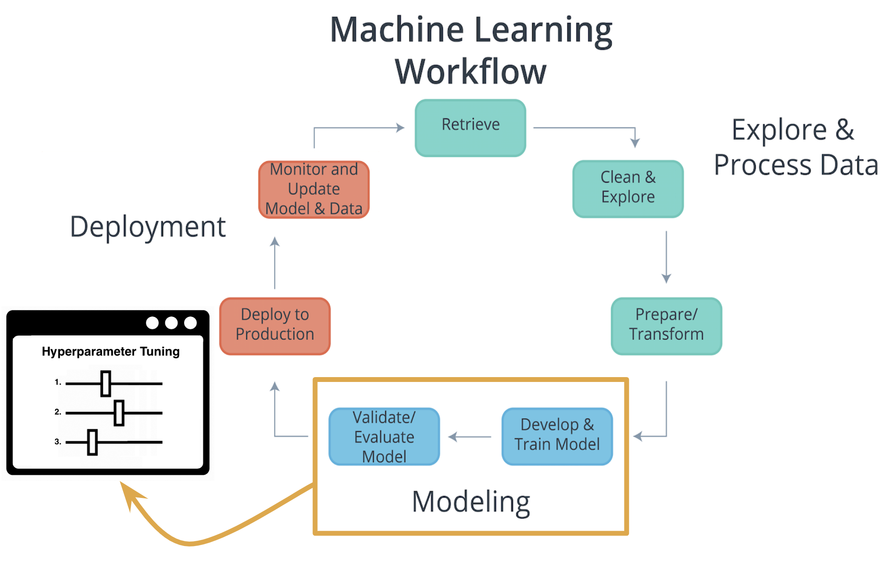

#### Characteristics of Modeling

**Hyperparameters**

In machine learning, a hyperparameter is a parameter whose value cannot be estimated from the data.

- Specifically, a hyperparameter is not directly learned through the estimators; therefore, their value must be set by the model developer.
- This means that hyperparameter tuning for optimization is an important part of model training.
- Often cloud platform machine learning services provide methods that allow for automatic hyperparameter tuning for use with model training.

If the machine learning platform fails to offer an automatic hyperparameter option, one option is to use methods from [scikit-learn](https://scikit-learn.org/stable/) Python library for hyperparameter tuning. Scikit-learn is a free machine learning Python library that includes methods that help with [hyperparameter tuning](https://scikit-learn.org/stable/modules/grid_search.html#).


#### Characteristics of Deployment

**Model Versioning**

One characteristic of deployment is the version of the model that is to be deployed.

- Besides saving the model version as a part of a model’s metadata in a database, the deployment platform should allow one to indicate a deployed model’s version.
This will make it easier to maintain, monitor, and update the deployed model.

**Model Monitoring**

Another characteristic of deployment is the ability to easily monitor your deployed models.

- Once a model is deployed you will want to make certain it continues to meet its performance metrics; otherwise, the application may need to be updated with a better performing model.

**Model Updating and Routing**

The ability to easily update your deployed model is another characteristic of deployment.

- If a deployed model is failing to meet its performance metrics, it's likely you will need to update this model.

If there's been a fundamental change in the data that’s being input into the model for predictions; you'll want to collect this input data to be used to update the model.

- The deployment platform should support routing differing proportions of user requests to the deployed models; to allow comparison of performance between the deployed model variants.

Routing in this way allows for a test of a model performance as compared to other model variants.

**Model Predictions**

Another characteristic of deployment is the type of predictions provided by your deployed model. There are two common types of predictions:

- On-demand predictions
- Batch predictions

**On-Demand Predictions**

- On-demand predictions might also be called:
  - online,
  - real-time, or
  - synchronous predictions
- With these type of predictions, one expects:
  - a low latency of response to each prediction request,
  - but allows for possibility high variability in request volume.
- Predictions are returned in the response from the request. Often these requests and responses are done through an API using JSON or XML formatted strings.
- Each prediction request from the user can contain one or many requests for predictions. Noting that many is limited based upon the size of the data sent as the request. Common cloud platforms on-demand prediction request size limits can range from 1.5(ML Engine) to 5 Megabytes (SageMaker).

On-demand predictions are commonly used to provide customers, users, or employees with real-time, online responses based upon a deployed model. Thinking back on our magic eight ball web application example, users of our web application would be making on-demand prediction requests.

**Batch Predictions**

- Batch predictions might also be called:
  - asynchronous, or
  - batch-based predictions.
- With these type of predictions, one expects:
  - high volume of requests with more periodic submissions
  - so latency won’t be an issue.
- Each batch request will point to specifically formatted data file of requests and will return the predictions to a file. Cloud services require these files will be stored in the cloud provider’s cloud.
- Cloud services typically have limits to how much data they can process with each batch request based upon limits they impose on the size of file you can store in their cloud storage service. For example, Amazon’s SageMaker limits batch predictions requests to the size limit they enforce on an object in their S3 storage service.

Batch predictions are commonly used to help make business decisions. For example, imagine a business uses a complex model to predict customer satisfaction across a number of their products and they need these estimates for a weekly report. This would require processing customer data through a batch prediction request on a weekly basis.

### Machine Learning Cloud Platforms

There are a number of machine learning cloud platforms, we provide more details about a few below. In the next few lessons, you will learn how to use Amazon's SageMaker to deploy machine learning models. Therefore, we focused on providing more information on Amazon's SageMaker. To allow for a comparison of features offered by SageMaker, we also provide detailed information about Google's ML Engine because it's most similar to SageMaker.

#### Amazon Web Services (AWS)

Amazon Web Services (AWS) SageMaker is Amazon's cloud service that allows you to build, train, and deploy machine learning models. Some advantages to using Amazon's SageMaker service are the following:

- Flexibility in Machine Learning Software: SageMaker has the flexibility to enable the use of any programming language or software framework for building, training, and deploying machine learning models in AWS. For the details see the three methods of modeling within SageMaker below.
  - [Built-in Algorithms](https://docs.aws.amazon.com/sagemaker/latest/dg/algos.html) - There are at least fifteen built-in algorithms that are easily used within SageMaker. Specifically, built-in algorithms for discrete classification or quantitative analysis using [linear learner](https://docs.aws.amazon.com/sagemaker/latest/dg/linear-learner.html) or [XGBoost](https://docs.aws.amazon.com/sagemaker/latest/dg/xgboost.html), item recommendations using [factorization machine](https://docs.aws.amazon.com/sagemaker/latest/dg/fact-machines.html), grouping based upon attributes using [K-Means](https://docs.aws.amazon.com/sagemaker/latest/dg/k-means.html), an algorithm for [image classification](https://docs.aws.amazon.com/sagemaker/latest/dg/image-classification.html), and many other algorithms.
  - Custom Algorithms - There are different programming languages and software frameworks that can be used to develop custom algorithms which include: [PyTorch](https://docs.aws.amazon.com/sagemaker/latest/dg/pytorch.html), [TensorFlow](https://docs.aws.amazon.com/sagemaker/latest/dg/tf.html), [Apache MXNet](https://docs.aws.amazon.com/sagemaker/latest/dg/mxnet.html), [Apache Spark](https://docs.aws.amazon.com/sagemaker/latest/dg/apache-spark.html), and [Chainer](https://docs.aws.amazon.com/sagemaker/latest/dg/chainer.html).
  - [Your Own Algorithms](https://docs.aws.amazon.com/sagemaker/latest/dg/your-algorithms.html) - Regardless of the programming language or software framework, you can use your own algorithm when it isn't included within the built-in or custom algorithms above.
- Ability to Explore and Process Data within SageMaker: SageMaker enables the use of [Jupyter Notebooks](https://docs.aws.amazon.com/sagemaker/latest/dg/nbi.html) to explore and process data, along with creation, training, validation, testing, and deployment of machine learning models. This notebook interface makes data exploration and documentation easier.
- Flexibility in Modeling and Deployment: SageMaker provides a number of features and automated tools that make modeling and deployment easier. For the details on these features within SageMaker see below.
  - [Automatic Model Tuning](https://docs.aws.amazon.com/sagemaker/latest/dg/automatic-model-tuning.html): SageMaker provides a feature that allows hyperparameter tuning to find the best version of the model for built-in and custom algorithms. For built-in algorithms SageMaker also provides evaluation metrics to evaluate the performance of your models.
  - [Monitoring Models](https://docs.aws.amazon.com/sagemaker/latest/dg/monitoring-overview.html): SageMaker provides features that allow you to monitor your deployed models. Additionally with model deployment, one can choose how much traffic to route to each deployed model (model variant). More information on routing traffic to model variants can be found [here](https://docs.aws.amazon.com/sagemaker/latest/dg/API_ProductionVariant.html) and [here](https://docs.aws.amazon.com/sagemaker/latest/dg/API_CreateEndpointConfig.html).
  - Type of Predictions: SageMaker by default allows for [On-demand](https://docs.aws.amazon.com/sagemaker/latest/dg/ex1-test-model.html) type of predictions where each prediction request can contain one to many requests. SageMaker also allows for [Batch](https://docs.aws.amazon.com/sagemaker/latest/dg/how-it-works-batch.html) predictions, and request data size limits are based upon S3 object size limits.

#### Google Cloud Platform (GCP)

Google Cloud Platform (GCP) ML Engine is Google's cloud service that allows you to build, train, and deploy machine learning models. Below we have highlighted some of the similarities and differences between these two cloud service platforms.

- Prediction Costs: The primary difference between the two is how they handle predictions. With SageMaker predictions, you must leave resources running to provide predictions. This enables less latency in providing predictions at the cost of paying for running idle services, if there are no (or few) prediction requests made while services are running. With ML Engine predictions, one has the option to not leave resources running which reduces cost associated with infrequent or periodic requests. Using this has more latency associated with predictions because the resources are in a offline state until they receive a prediction request. The increased latency is associated to bringing resources back online, but one only pays for the time the resources are in use. To see more about [ML Engine pricing](https://cloud.google.com/ml-engine/docs/pricing#node-hour) and [SageMaker pricing](https://cloud.google.com/ml-engine/docs/pricing#node-hour).
- Ability to Explore and Process Data: Another difference between ML Engine and SageMaker is the fact that Jupyter Notebooks are not available within ML Engine. To use Jupyter Notebooks within Google's Cloud Platform (GCP), one would use [Datalab](https://cloud.google.com/datalab/docs/). GCP separates data exploration, processing, and transformation into other services. Specifically, Google's Datalab can be used for data exploration and data processing, [Dataprep](https://cloud.google.com/dataprep/docs/) can be used to explore and transform raw data into clean data for analysis and processing, and [DataFlow](https://cloud.google.com/dataflow/docs/) can be used to deploy batch and streaming data processing pipelines. Noting that Amazon Web Services (AWS), also have data processing and transformation pipeline services like [AWS Glue](https://aws.amazon.com/glue/) and [AWS Data Pipeline](https://aws.amazon.com/datapipeline/).
- Machine Learning Software: The final difference is that Google's ML Engine has less flexibility in available software frameworks for building, training, and deploying machine learning models in GCP as compared to Amazon's SageMaker. For the details regarding the two available software frameworks for modeling within ML Engine see below.
  - [Google's TensorFlow](https://cloud.google.com/ml-engine/docs/tensorflow/) is an open source machine learning framework that was originally developed by the Google Brain team. TensorFlow can be used for creating, training, and deploying machine learning and deep learning models. [Keras](https://keras.io/) is a higher level API written in Python that runs on top of TensorFlow, that's easier to use and allows for faster development. GCP provides both [TensorFlow examples](https://cloud.google.com/ml-engine/docs/tensorflow/samples) and a [Keras example](https://cloud.google.com/ml-engine/docs/tensorflow/samples#census-keras).
  - [Google's Scikit-learn](https://cloud.google.com/ml-engine/docs/scikit/) is an open source machine learning framework in Python that was originally developed as a Google Summer of Code project. Scikit-learn and an [XGBoost Python package](https://xgboost.readthedocs.io/en/latest/python/index.html) can be used together for creating, training, and deploying machine learning models. In [Google's example](https://cloud.google.com/ml-engine/docs/scikit/training-xgboost), XGBoost is used for modeling and Scikit-learn is used for processing the data.
- Flexibility in Modeling and Deployment: Google's ML Engine provides a number of features and automated tools that make modeling and deployment easier, similar to the those provided by Amazon's SageMaker. For the details on these features within ML Engine see below.
  - [Automatic Model Tuning](https://cloud.google.com/ml-engine/docs/tensorflow/hyperparameter-tuning-overview): Google's ML Engine provides a feature that enables hyperparameter tuning to find the best version of the model.
  - [Monitoring Models](https://cloud.google.com/ml-engine/docs/tensorflow/monitor-training): Google's ML Engine provides features that allow you to monitor your models. Additionally ML Engine provides methods that enable [managing runtime versions](https://cloud.google.com/ml-engine/docs/tensorflow/versioning) and [managing models and jobs](https://cloud.google.com/ml-engine/docs/tensorflow/managing-models-jobs).
  - Type of Predictions: ML Engine allows for [Online](https://cloud.google.com/ml-engine/docs/tensorflow/online-predict)(or On-demand) type of predictions where each prediction request can contain one to many requests. ML Engine also allows for [Batch](https://cloud.google.com/ml-engine/docs/tensorflow/batch-predict) predictions. More information about ML Engine's [Online and Batch predictions](https://cloud.google.com/ml-engine/docs/tensorflow/online-vs-batch-prediction).

#### Microsoft Azure

Similar to Amazon's SageMaker and Google's ML Engine, Microsoft offers [Azure AI](https://azure.microsoft.com/en-us/overview/ai-platform/#platform). Azure AI offers an open and comprehensive platform that includes AI software frameworks like: TensorFlow, PyTorch, scikit-learn, MxNet, Chainer, Caffe2, and other software like their pAzure Machine Learning Studio](https://azure.microsoft.com/en-us/services/machine-learning-studio/). For more details see Azure AI and Azure Machine Learning Studio.

#### Paperspace

[Paperspace](https://www.paperspace.com/ml) simply provides GPU-backed virtual machines with industry standard software tools and frameworks like: TensorFlow, Keras, Caffe, and Torch for machine learning, deep learning, and data science. Paperspace claims to provide more powerful and less expensive virtual machines than are offered by AWS, GCP, or Azure.

#### Cloud Foundry

[Cloud Foundry](https://www.cloudfoundry.org/) is an open source cloud application platform that's backed by companies like: Cisco, Google, IBM, Microsoft, SAP, and more. Cloud Foundry provides a faster and easier way to build, test, deploy, and scale applications by providing a choice of clouds, developer frameworks, and applications services to it's users. [Cloud Foundry Certified Platforms](https://www.cloudfoundry.org/certified-platforms/) provide a way for an organization to have their cloud applications portable across platforms including [IBM](https://www.ibm.com/cloud/cloud-foundry) and [SAP](https://cloudplatform.sap.com/index.html) cloud platforms.

## Building a Model using SageMaker

### AWS Setup Instructions

- Open a regular AWS account (if you don't already have one) following the instructions via the [Amazon Web Service Help Center](https://aws.amazon.com/premiumsupport/knowledge-center/create-and-activate-aws-account/)
- You will need a promo code from us so you can apply it to your account. To request a promo code, you can submit a support ticket [here](https://udacity.zendesk.com/hc/en-us/requests/new?ticket_form_id=110806).
  - Under the "Reason for Contact" field, choose "Other", then choose "External Tools" in the dropdown.
  - When the "External Tools" field appears, select "AWS".
  - Please note that a regular AWS account will receive a promo code from Udacity with a fixed amount of AWS credits.
- To apply your promo code, follow below:
  - Click "Credits" on the left side of the screen and enter the promo-code you received, then hit "redeem".
  - Refresh the page and you will be able to view your credits under: Below are all the credits you have redeemed with AWS. Credits will automatically be applied to your bill.

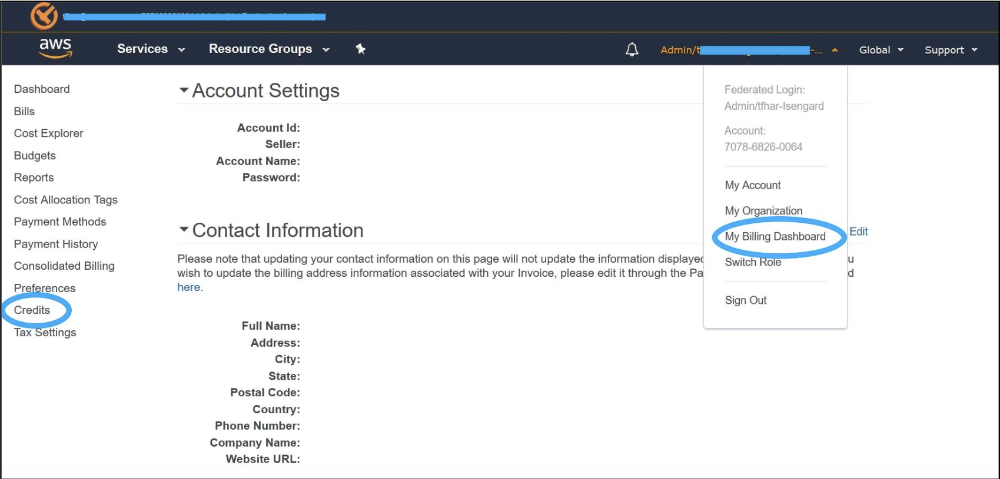

### Get Access to GPU Instances

#### What is EC2?

Amazon Web Services has a service called Elastic Compute Cloud (EC2), which allows you to launch virtual servers (or “instances”), including instances with attached GPUs. The specific type of GPU instance you should launch for this tutorial is called “p2.xlarge”.

#### What is a Amazon Machine Image?

Amazon Machine Image or AMI is a template for an operating system and basic services (e.g., an application server and specific applications). By running an AMI instance, the AMI will be running "as a virtual server in the cloud" (as per [AWS Documentation](https://docs.aws.amazon.com/AWSEC2/latest/UserGuide/ec2-instances-and-amis.html).

We will use this [AMI image](https://aws.amazon.com/marketplace/pp/B077GF11NF) to define the operating system for your instance and to make use of its pre-installed software. In order to use this AMI, you must change your AWS region to one of the following (and you are encouraged to select the region in the list that is closest to you):

- EU (Ireland)
- Asia Pacific (Seoul)
- Asia Pacific (Tokyo)
- Asia Pacific (Sydney)
- US East (N. Virginia)
- US East (Ohio)
- US West (Oregon)

If you are unsure, please check the [AWS documentation](https://docs.aws.amazon.com/AWSEC2/latest/UserGuide/using-regions-availability-zones.html) to confirm which region may be closest to you. After changing your AWS region, view your EC2 Service Limit report at this [link](https://console.aws.amazon.com/ec2/v2/home?#Limits), and find your "Current Limit" for the p2.xlarge instance type.

#### What is a P2 instance?

P2 are powerful and scalable parallel processing GPU instances. You can read more about these on AWS Documentation.

**DO NOT FORGET TO SHUT DOWN YOUR EC2 INSTANCE or YOU WILL RUN OUT OF YOUR FREE PROMO CREDITS.**

Your credits will be used for any inactive running instances. If you are in the middle of the project and need to step away, PLEASE SHUT DOWN YOUR EC2 INSTANCE. You can re-instantiate later. We have provided adequate credits to allow you to complete your projects.

#### How to increase your instance limits to complete the project

**View Your Current Limit**

After changing your AWS region, view your [EC2 Service Limit report at this link](https://console.aws.amazon.com/ec2/v2/home?#Limits), and find your "Current Limit" for the p2.xlarge instance type. By default, AWS sets a limit of 0 on the number of p2.xlarge instances a user can run, which effectively prevents you from launching this instance.

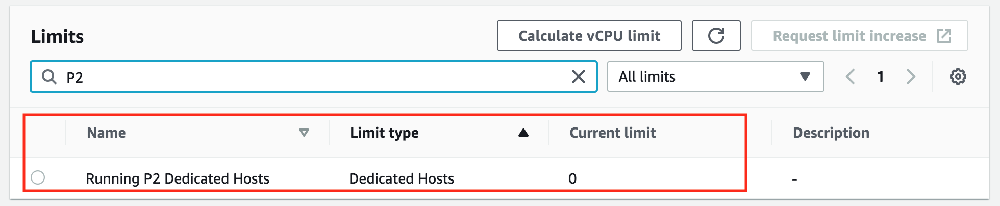

**Submit a Limit Increase Request**

If your limit of p2.xlarge instances is 0, you'll need to increase the limit before you can launch an instance. From the EC2 Service Limits page, CLICK TO EDIT Calculate vCPU limit on top.

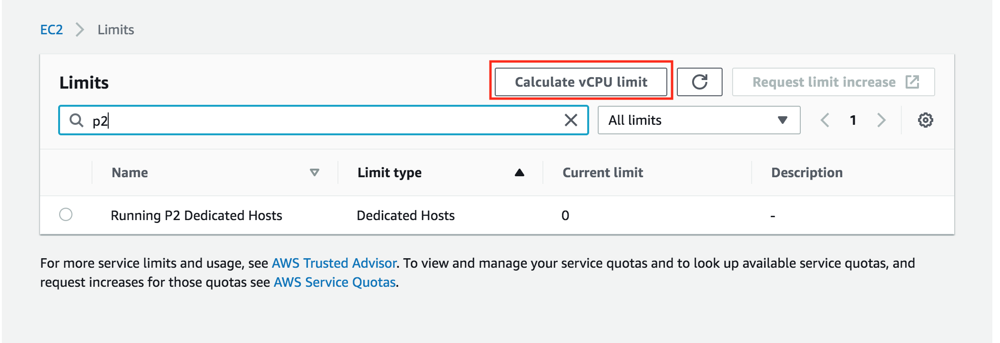

The following screen pops up.

In the Instance type search for p2.xlarge and the Instance count to 1, verify the New limit is showing 4 vCPUs and then click on Request limit increase

Note: You won't be charged for requesting a limit increase. AWS will only charge you once you have launched the instance.


This will open the following screen.

Click on the Service limit increase if it is not already selected.

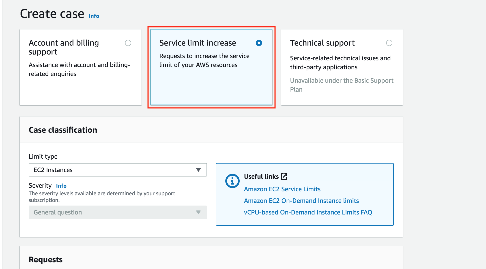

In Requests section pick your "Primary Instance type" as "All P instances" and "1" for "New limit value"

Note: If you have never launched an instance of any type on AWS, you might receive an email from AWS Support asking you to initialize your account by creating an instance before they approve the limit increase.

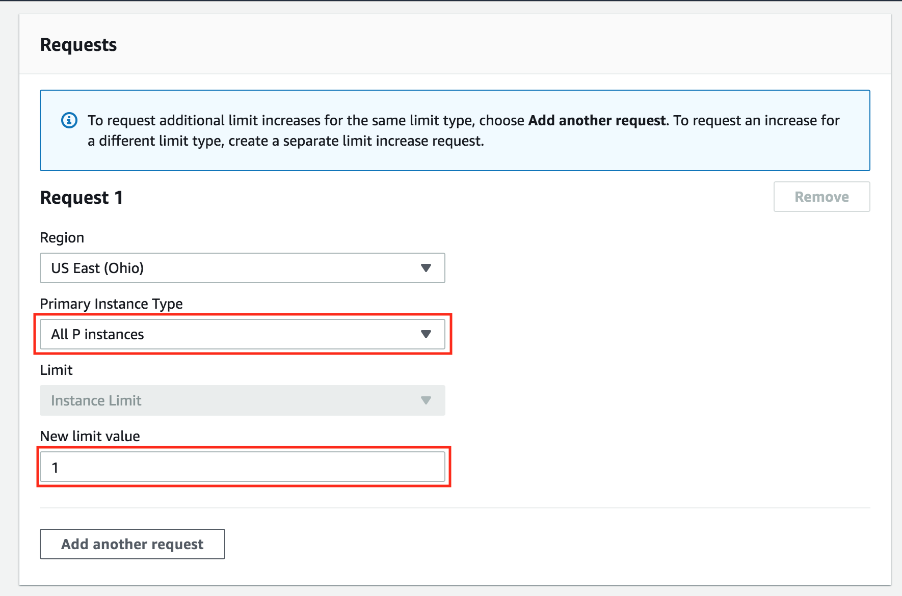

**Wait for Approval**

You must wait for AWS to approve your Limit Increase Request. AWS typically approves these requests within 48 hours.

**IMPORTANT NOTICE**: This is the current AWS UI as of March 26th, 2020. The AWS UI is subject to change on a regular basis. We advise students to refer to AWS documentation for the above process.

### Setting up a Notebook Instance

The first thing we are going to need to do is set up a notebook instance!

This will be the primary way in which we interact with the SageMaker ecosystem. Of course, this is not the only way to interact with SageMaker's functionality, but it is the way that we will use in this module.

The video below guides you through setting up your first notebook instance. Also, if you prefer to read the instructions instead, these have been provided underneath the video.

Note: Once a notebook instance has been set up, by default, it will be InService which means that the notebook instance is running. This is important to know because the cost of a notebook instance is based on the length of time that it has been running. This means that once you are finished using a notebook instance you should Stop it so that you are no longer incurring a cost. Don't worry though, you won't lose any data provided you don't delete the instance. Just start the instance back up when you have time and all of your saved data will still be there.

#### Searching for SageMaker

Your main console page may look slightly different than in the above example. You should still be able to find Amazon SageMaker by either:

- Clicking on All Services then scrolling down and navigating to Machine Learning> Amazon SageMaker, or
- By searching for SageMaker, as in the below screenshot (and clicking on it).

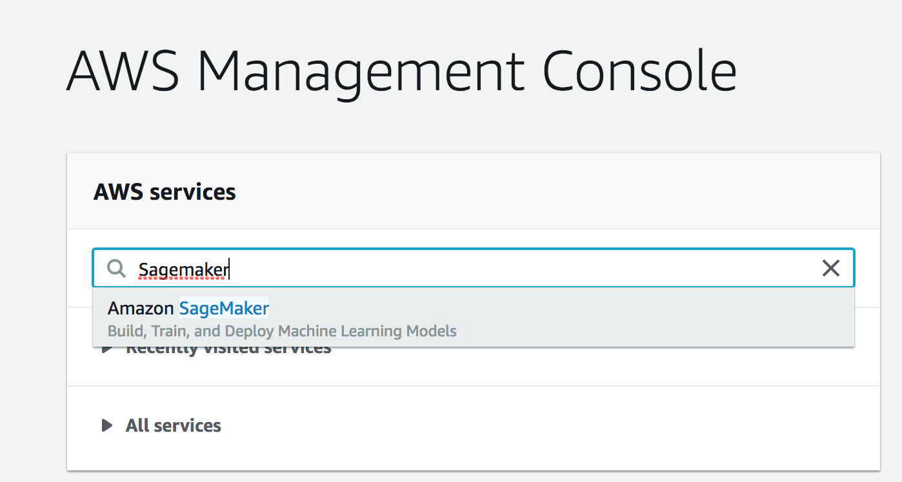

#### Creating and Running a Notebook Instance

First, start by logging in to the [AWS console](https://console.aws.amazon.com/), opening the SageMaker dashboard, selecting Notebook Instances and clicking on Create notebook instance.

You may choose any name you would like for your notebook. Also, using ml.t2.medium should be all that is necessary for the notebooks that you will encounter in this module. In addition, an ml.t2.medium instance is covered under the free tier.

Next, under IAM role select Create a new role. You should get a pop-up window that looks like the one below. The only change that needs to be made is to select None under S3 buckets you specify, as is shown in the image below.

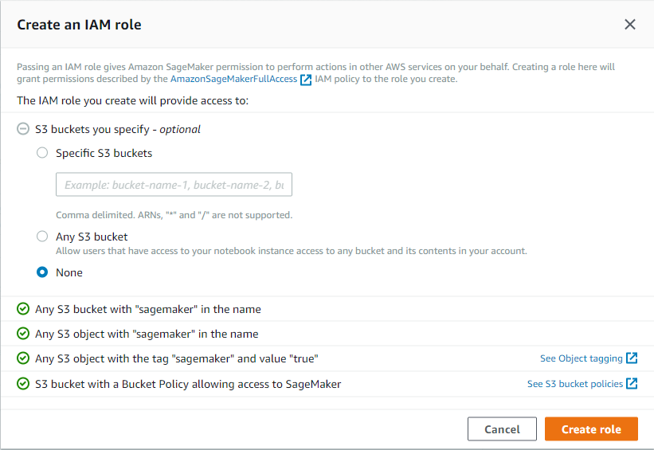

Once you have finished setting up the role for your notebook, your notebook instance settings should look something like the image below.

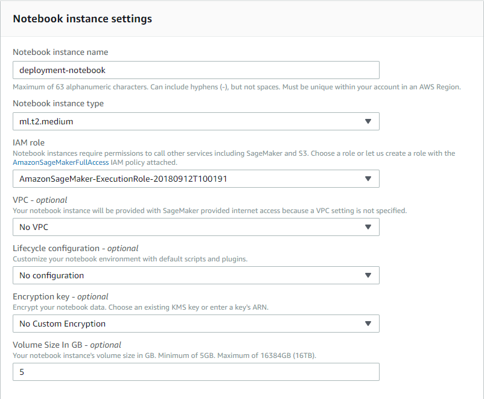

Note: Your notebook name may be different than the one displayed and the IAM role that appears will be different.

Now scroll down and click on Create notebook instance.

Once your notebook instance has started and is accessible, click on open to get to the Jupyter notebook main page.

### Cloning the Deployment Notebooks

Recently, SageMaker has added a line in the setup code to link directly to a Github repository and it's recommended that you use that setup!

Also on the `Actions` list, you should select `Open Jupyter` to get to the examples notebooks. from the dropdown menu, you'll still be able to see the `Stop` action.

---

Now that your notebook instance has been set up and is running, it's time to get the notebooks that we will be using during this module.

These notebooks are stored in a [repository on Github](https://github.com/udacity/sagemaker-deployment) and the easiest way to make them available inside of your notebook instance is to use git and clone the repository.

In order to clone the deployment repository into your notebook instance, click on the new drop down menu and select terminal. By default, the working directory of the terminal instance is the home directory, however, the Jupyter notebook hub's root directory is under `SageMaker`. Enter the appropriate directory and clone the repository as follows:

```
cd SageMaker
git clone https://github.com/udacity/sagemaker-deployment.git
exit
```

After you have finished, close the terminal window.

Your notebook instance is now set up and ready to be used!

## Deploying and Using a Model

## Hyperparameter Tuning

## Updating a Model