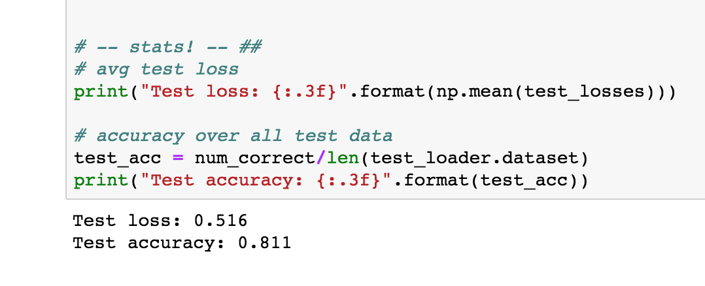

# NLP Fundamentals

## Introduction to NLP

### How NLP Pipelines Work

Text Processing -> Feature Extraction -> Modeling

### Text Processing

- It turns raw data into clean and normalized form
- Raw data sources
  - HTML
  - PDF
  - Voice
  - etc.
- Common Steps
  - Remove stop words
  - Lowercase
  - etc.

### Featrue Extraction

- Bag of Words
- TF-IDF
- Word2Vec
- GloVe

### Modeling

- Machine learning models

## Implementation of RNN & LSTM

### Time-Series Prediction

- [notebook](https://github.com/udacity/deep-learning-v2-pytorch/blob/master/recurrent-neural-networks/time-series/Simple_RNN.ipynb)

### Training & Memory

Here is the documentation for the main types of [recurrent layers in PyTorch](https://pytorch.org/docs/stable/nn.html#recurrent-layers). Take a look and read about the three main types: RNN, LSTM, and GRU.

### Character-Level RNN

To open this notebook, you have two options:

- Go to the next page in the classroom (recommended).
- Clone the repo from [Github](https://github.com/udacity/deep-learning-v2-pytorch) and open the notebook Character_Level_RNN_Exercise.ipynb in the recurrent-neural-networks > char-rnn folder. You can either download the repository with `git clone https://github.com/udacity/deep-learning-v2-pytorch.git`, or download it as an archive file from [this link](https://github.com/udacity/deep-learning-v2-pytorch/archive/master.zip).

**Instructions**

- Load in text data
- Pre-process that data, encoding characters as integers and creating one-hot input vectors
- Define an RNN that predicts the next character when given an input sequence
- Train the RNN and use it to generate new text

This is a self-assessed lab. If you need any help or want to check your answers, feel free to check out the solutions notebook in the same folder, or by clicking [here](https://github.com/udacity/deep-learning-v2-pytorch/blob/master/recurrent-neural-networks/char-rnn/Character_Level_RNN_Solution.ipynb).

### Examples of RNNs

Take a look at one of my favorite examples of RNNs making predictions based on some user-generated input dat: the [sketch-rnn by Magenta](https://magenta.tensorflow.org/assets/sketch_rnn_demo/index.html). This RNN takes as input a starting sketch, drawn by you, and then tries to complete your sketch using a particular model. For example, it can learn to complete a sketch of a pineapple or the mona lisa!

## Sentiment Prediction RNN

### Notebook: Sentiment RNN

To open this notebook, you have two options:

- Go to the next page in the classroom (recommended).
- Clone the repo from [Github](https://github.com/udacity/deep-learning-v2-pytorch) and open the notebook Sentiment_RNN_Exercise.ipynb in the sentiment-rnn folder. You can either download the repository with `git clone https://github.com/udacity/deep-learning-v2-pytorch.git`, or download it as an archive file from [this link](https://github.com/udacity/deep-learning-v2-pytorch/archive/master.zip).

**Instructions**

- Load in text data
- Pre-process that data, encoding characters as integers
- Pad the data such that each review is a standard sequence length
- Define an RNN with embedding and hidden LSTM layers that predicts the sentiment of a given review
- Train the RNN
- See how it performs on test data

This is a self-assessed lab. If you need any help or want to check your answers, feel free to check out the solutions notebook in the same folder, or by clicking [here](https://github.com/udacity/deep-learning-v2-pytorch/blob/master/sentiment-rnn/Sentiment_RNN_Solution.ipynb).

### Complete Sentiment RNN

> I know I want an embedding layer, a recurrent layer, and a final, linear layer with a sigmoid applied; I defined all of those in the __init__ function, according to passed in parameters.

```python
def __init__(self, vocab_size, output_size, embedding_dim, hidden_dim, n_layers, drop_prob=0.5):
        """
        Initialize the model by setting up the layers.
        """
        super(SentimentRNN, self).__init__()

        self.output_size = output_size
        self.n_layers = n_layers
        self.hidden_dim = hidden_dim

        # embedding and LSTM layers
        self.embedding = nn.Embedding(vocab_size, embedding_dim)
        self.lstm = nn.LSTM(embedding_dim, hidden_dim, n_layers, 
                            dropout=drop_prob, batch_first=True)

        # dropout layer
        self.dropout = nn.Dropout(0.3)

        # linear and sigmoid layers
        self.fc = nn.Linear(hidden_dim, output_size)
        self.sig = nn.Sigmoid()
```

**`__init__` explanation**

First I have an embedding layer, which should take in the size of our vocabulary (our number of integer tokens) and produce an embedding of `embedding_dim` size. So, as this model trains, this is going to create and embedding lookup table that has as many rows as we have word integers, and as many columns as the embedding dimension.

Then, I have an LSTM layer, which takes in inputs of `embedding_dim` size. So, it's accepting embeddings as inputs, and producing an output and hidden state of a hidden size. I am also specifying a number of layers, and a dropout value, and finally, I’m setting `batch_first` to True because we are using DataLoaders to batch our data like that!

Then, the LSTM outputs are passed to a dropout layer and then a fully-connected, linear layer that will produce `output_size` number of outputs. And finally, I’ve defined a sigmoid layer to convert the output to a value between 0-1.

**Feedforward behavior**

Moving on to the `forward` function, which takes in an input `x` and a `hidden` state, I am going to pass an input through these layers in sequence.

```python
def forward(self, x, hidden):
        """
        Perform a forward pass of our model on some input and hidden state.
        """
        batch_size = x.size(0)

        # embeddings and lstm_out
        embeds = self.embedding(x)
        lstm_out, hidden = self.lstm(embeds, hidden)

        # stack up lstm outputs
        lstm_out = lstm_out.contiguous().view(-1, self.hidden_dim)

        # dropout and fully-connected layer
        out = self.dropout(lstm_out)
        out = self.fc(out)

        # sigmoid function
        sig_out = self.sig(out)

        # reshape to be batch_size first
        sig_out = sig_out.view(batch_size, -1)
        sig_out = sig_out[:, -1] # get last batch of labels

        # return last sigmoid output and hidden state
        return sig_out, hidden
```

**`forward` explanation**

So, first, I'm getting the `batch_size` of my input x, which I’ll use for shaping my data. Then, I'm passing x through the embedding layer first, to get my embeddings as output

These embeddings are passed to my lstm layer, alongside a hidden state, and this returns an `lstm_output` and a new `hidden` state! Then I'm going to stack up the outputs of my LSTM to pass to my last linear layer.

Then I keep going, passing the reshaped `lstm_output` to a dropout layer and my linear layer, which should return a specified number of outputs that I will pass to my sigmoid activation function.

Now, I want to make sure that I’m returning only the last of these sigmoid outputs for a batch of input data, so, I’m going to shape these outputs into a shape that is `batch_size` first. Then I'm getting the last bacth by called `sig_out[:, -1], and that’s going to give me the batch of last labels that I want!

Finally, I am returning that output and the hidden state produced by the LSTM layer.

**`init_hidden`**

That completes my forward function and then I have one more: `init_hidden` and this is just the same as you’ve seen before. The hidden and cell states of an LSTM are a tuple of values and each of these is size (n_layers by batch_size, by hidden_dim). I’m initializing these hidden weights to all zeros, and moving to a gpu if available.

```python
def init_hidden(self, batch_size):
        ''' Initializes hidden state '''
        # Create two new tensors with sizes n_layers x batch_size x hidden_dim,
        # initialized to zero, for hidden state and cell state of LSTM
        weight = next(self.parameters()).data

        if (train_on_gpu):
            hidden = (weight.new(self.n_layers, batch_size, self.hidden_dim).zero_().cuda(),
                  weight.new(self.n_layers, batch_size, self.hidden_dim).zero_().cuda())
        else:
            hidden = (weight.new(self.n_layers, batch_size, self.hidden_dim).zero_(),
                      weight.new(self.n_layers, batch_size, self.hidden_dim).zero_())

        return hidden
```

### Training the Model

#### Hyperparameters

After defining my model, next I should instantiate it with some hyperparameters.

```python
# Instantiate the model w/ hyperparams
vocab_size = len(vocab_to_int)+1 # +1 for the 0 padding + our word tokens
output_size = 1
embedding_dim = 400
hidden_dim = 256
n_layers = 2

net = SentimentRNN(vocab_size, output_size, embedding_dim, hidden_dim, n_layers)

print(net)
```

This should look familiar, but the main thing to note here is our `vocab_size`.

This is actually the length of our `vocab_to_int` dictionary (all our unique words) plus one to account for the `0`-token that we added, when we padded our input features. So, if you do data pre-processing, you may end up with one or two extra, special tokens that you’ll need to account for, in this parameter!

Then, I want my `output_size` to be 1; this will be a sigmoid value between 0 and 1, indicating whether a review is positive or negative.

Then I have my embedding and hidden dimension. The embedding dimension is just a smaller representation of my vocabulary of 70k words and I think any value between like 200 and 500 or so would work, here. I’ve chosen 400. Similarly, for our hidden dimension, I think 256 hidden features should be enough to distinguish between positive and negative reviews.

I’m also choosing to make a 2 layer LSTM. Finally, I’m instantiating my model and printing it out to make sure everything looks good.


#### Training and Optimization

The training code, should look pretty familiar. One new detail is that, we'll be using a new kind of cross entropy loss that is designed to work with a single Sigmoid output.

> [BCELoss](https://pytorch.org/docs/stable/nn.html#bceloss), or Binary Cross Entropy Loss, applies cross entropy loss to a single value between 0 and 1.

We'll define an Adam optimizer, as usual.

```python
# loss and optimization functions
lr=0.001

criterion = nn.BCELoss()
optimizer = torch.optim.Adam(net.parameters(), lr=lr)
```

**Output, target format**

You should also notice that, in the training loop, we are making sure that our outputs are squeezed so that they do not have an empty dimension `output.squeeze()` and the labels are float tensors, `labels.float()`. Then we perform backpropagation as usual.

**Train and eval mode**

Below, you can also see that we switch between train and evaluation mode when the model is training versus when it is being evaluated on validation data!

**Training Loop**

Below, you’ll see a usual training loop.

I’m actually only going to do four epochs of training because that's about when I noticed the validation loss stop decreasing.

- You can see that I am initializing my hidden state before entering the batch loop then have my usual detachment from history for the hidden state and backpropagation steps.
- I’m getting my input and label data from my train_dataloader. Then applying my model to the inputs and comparing the outputs and the true labels.
- I also have some code that checks performance on my validation set, which, if you want, may be a great thing to use to decide when to stop training or which best model to save!

```python
# training params

epochs = 4 # 3-4 is approx where I noticed the validation loss stop decreasing

counter = 0
print_every = 100
clip=5 # gradient clipping

# move model to GPU, if available
if(train_on_gpu):
    net.cuda()

net.train()
# train for some number of epochs
for e in range(epochs):
    # initialize hidden state
    h = net.init_hidden(batch_size)

    # batch loop
    for inputs, labels in train_loader:
        counter += 1

        if(train_on_gpu):
            inputs, labels = inputs.cuda(), labels.cuda()

        # Creating new variables for the hidden state, otherwise
        # we'd backprop through the entire training history
        h = tuple([each.data for each in h])

        # zero accumulated gradients
        net.zero_grad()

        # get the output from the model
        output, h = net(inputs, h)

        # calculate the loss and perform backprop
        loss = criterion(output.squeeze(), labels.float())
        loss.backward()
        # `clip_grad_norm` helps prevent the exploding gradient problem in RNNs / LSTMs.
        nn.utils.clip_grad_norm_(net.parameters(), clip)
        optimizer.step()

        # loss stats
        if counter % print_every == 0:
            # Get validation loss
            val_h = net.init_hidden(batch_size)
            val_losses = []
            net.eval()
            for inputs, labels in valid_loader:

                # Creating new variables for the hidden state, otherwise
                # we'd backprop through the entire training history
                val_h = tuple([each.data for each in val_h])

                if(train_on_gpu):
                    inputs, labels = inputs.cuda(), labels.cuda()

                output, val_h = net(inputs, val_h)
                val_loss = criterion(output.squeeze(), labels.float())

                val_losses.append(val_loss.item())

            net.train()
            print("Epoch: {}/{}...".format(e+1, epochs),
                  "Step: {}...".format(counter),
                  "Loss: {:.6f}...".format(loss.item()),
                  "Val Loss: {:.6f}".format(np.mean(val_losses)))
```

Make sure to take a look at how training and validation loss decrease during training! Then, once you're satisfied with your trained model, you can test it out in a couple ways to see how it behaves on new data!

### Testing the Trained Model

I want to show you two great ways to test: using test data and using inference. The first is similar to what you’ve seen in our CNN lessons. I am iterating through the test data in the `test_loader`, recording the test loss and calculating the accuracy based on how many labels this model got correct!

I’m doing this by looking at the rounded value of our output. Recall that this is a sigmoid output between 0-1 and so rounding this value will give us an integer that is the most likely label: 0 or 1. Then I’m comparing that predicted label to the true label; if it matches, I record that as a correctly-labeled test review.

```python
# Get test data loss and accuracy

test_losses = [] # track loss
num_correct = 0

# init hidden state
h = net.init_hidden(batch_size)

net.eval()
# iterate over test data
for inputs, labels in test_loader:

    # Creating new variables for the hidden state, otherwise
    # we'd backprop through the entire training history
    h = tuple([each.data for each in h])

    if(train_on_gpu):
        inputs, labels = inputs.cuda(), labels.cuda()

    # get predicted outputs
    output, h = net(inputs, h)

    # calculate loss
    test_loss = criterion(output.squeeze(), labels.float())
    test_losses.append(test_loss.item())

    # convert output probabilities to predicted class (0 or 1)
    pred = torch.round(output.squeeze())  # rounds to the nearest integer

    # compare predictions to true label
    correct_tensor = pred.eq(labels.float().view_as(pred))
    correct = np.squeeze(correct_tensor.numpy()) if not train_on_gpu else np.squeeze(correct_tensor.cpu().numpy())
    num_correct += np.sum(correct)


# -- stats! -- ##
# avg test loss
print("Test loss: {:.3f}".format(np.mean(test_losses)))

# accuracy over all test data
test_acc = num_correct/len(test_loader.dataset)
print("Test accuracy: {:.3f}".format(test_acc))
```

Below, I’m printing out the average test loss and the accuracy, which is just the number of correctly classified items divided by the number of pieces of test data,total.

We can see that the test loss is `0.516` and the accuracy is about 81.1% !



### Inference

Let's put all these pieces together! One of the coolest ways to test a model like this is to give it user-generated data, without any true label, and see what happens. So, in this case, that data will just be a single string: a review that you can write and here’s just one `test_review` as an example:

```python
# negative test review
test_review_neg = 'The worst movie I have seen; acting was terrible and I want my money back. This movie had bad acting and the dialogue was slow.'
```

We can see that this review is a negative one, but let's see if our model can identify it's sentiment correctly!

Our task is to write a `predict` function that takes in a trained model, a `test_review` like this one that is just normal text and punctuation, a `sequence_length` for padding.

The process by which you make predictions based on user data, is called inference.

**Pre-process the `test_review`**

The first thing we'll have to do it to process the `test_review`, so that it is converted into a tensor that our model can see as input. In fact, this involves quite a lot of pre-processing, but nothing that you haven't seen before!

I broke this down into a series of steps.

I have a helper function `tokenize_review` that is responsible for doing some data processing on my test_review.

It takes in my test_review, and then does a couple of things:

1. First, I convert my `test_review` to lowercase, and remove any punctuation, so I’m left with all text.
2. Then I breaks it into individual words with split(), and I’m left with a list of words in the review.
3. I encode those words using the `vocab_to_int` dictionary that we already defined, near the start of this lesson.

Now, I am assuming a few things here, including: this review is one review, not a batch, and that this review only includes words already in our dictionary, and in this case that will be true, but you can add code to handle unknown characters, I just didn’t do that in my model.

```python
from string import punctuation

def tokenize_review(test_review):
    test_review = test_review.lower() # lowercase
    # get rid of punctuation
    test_text = ''.join([c for c in test_review if c not in punctuation])

    # splitting by spaces
    test_words = test_text.split()

    # tokens
    test_ints = []
    test_ints.append([vocab_to_int[word] for word in test_words])

    return test_ints
```

Okay, so this tokenize function returns a list of integers; my tokenized review!

**Padding and converting into a Tensor**

For my next couple of steps, I’m going to pad the ints, returned by the `tokenize_review` function and shape them into our `sequence_length` size; since our model was trained on sequence lengths of 200, I’m going to use the same length, here. I'll pad it using the `pad_features` function that we defined earlier.

Finally, I’m going to convert the padded result into a Tensor. So, these are all the steps, and I’m going to wrap this all up in my predict function.

```python
def predict(net, test_review, sequence_length=200):

    net.eval()

    # tokenize review
    test_ints = tokenize_review(test_review)

    # pad tokenized sequence
    seq_length=sequence_length
    features = pad_features(test_ints, seq_length)

    # convert to tensor to pass into your model
    feature_tensor = torch.from_numpy(features)

    batch_size = feature_tensor.size(0)

    # initialize hidden state
    h = net.init_hidden(batch_size)

    if(train_on_gpu):
        feature_tensor = feature_tensor.cuda()

    # get the output from the model
    output, h = net(feature_tensor, h)

    # convert output probabilities to predicted class (0 or 1)
    pred = torch.round(output.squeeze()) 
    # printing output value, before rounding
    print('Prediction value, pre-rounding: {:.6f}'.format(output.item()))

    # print custom response
    if(pred.item()==1):
        print("Positive review detected!")
    else:
        print("Negative review detected.")
```

So, using the passed in arguments, I’m tokenizing my review using my helper function, then padding it using my pad function, and converting it into a Tensor that can be seen by my model.

Then, I’m passing this tensor into my trained net which will return an output of length one. With this output, I can grab the most likely class, which will be the rounded value 0 or 1; this is my prediction!

Lastly, I want to print out a custom message for a positive or negative detected review, and I’m doing that at the bottom of the above function!

You can test this out on sample positive and negative text reviews to see how this trained model behaves! Below, you can see how it identifies our negative test review correctly.


