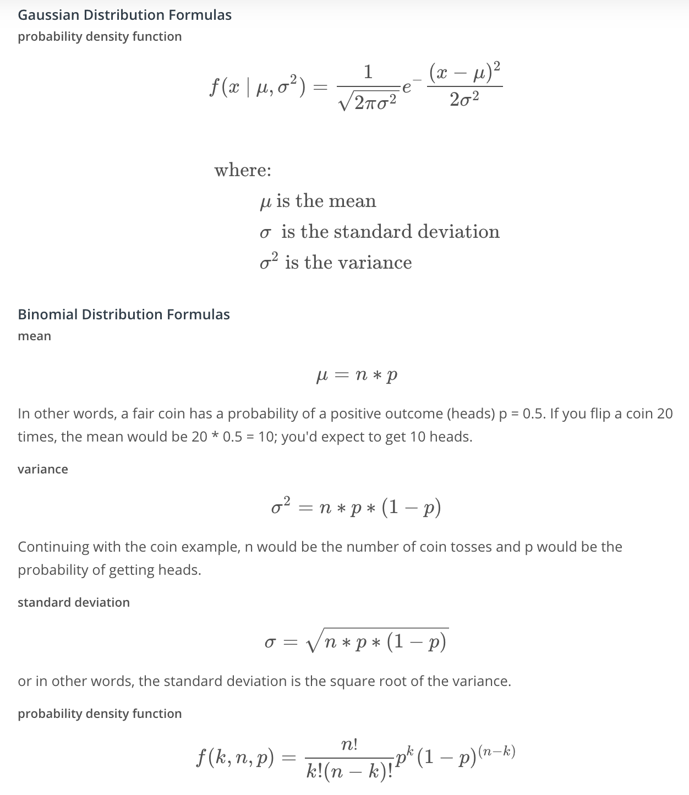

# Software Engineering Fundamentals

## Introduction to Software Engineering

- Introduction To Software Engineering
  - Although the language used throughout these videos is aimed primarily at data scientists, know these skills and their applications are relevant for many professions in software. Potential careers include, but are not limited to:
    - Data Scientists
    - Software Engineers
    - Machine Learning Engineers
    - Quality Software Engineers
    - Database Administrators
- How this Course is Organized
  - Software Engineering Practices Part 1 covers how to write well documented, modularized code.
  - Software Engineering Practices Part 2 discusses testing your code and logging.
  - Introduction to Object-Oriented Programming gives you an overview of this programming style and prepares you to write your own Python package.
  - Introduction to Web Development covers building a web application data dashboard.
- Course Portfolio Exercises
  - The software engineering course has two portfolio exercises: building a Python package and developing a web data dashboard. These exercises are NOT reviewed and are NOT required to graduate from the data scientist nanodegree program. In other words, you will not submit either of the portfolio projects to the Udacity review system. Instead, you can use these projects to practice your software engineering skills and then add the projects to your professional portfolio.
  - Having said that, the skills covered in this course will set you up for success in other Udacity courses with required projects. For example, the data engineering for data scientists course has a required project where you are expected to write clean, concise and well-documented code. You will also have an easier time with that project if you understand the fundamentals of object-oriented programming and a basic understanding of how the backend and frontend of a website works.

## Software Engineering Practices Pt I

In this lesson, you'll learn about the following practices of software engineering and how they apply in data science.
- Writing clean and modular code
- Writing efficient code
- Code refactoring
- Adding meaningful documentation
- Using version control

### Clean and Modular Code

- PRODUCTION CODE: softßware running on production servers to handle live users and data of the intended audience. Note this is different from production quality code, which describes code that meets expectations in reliability, efficiency, etc., for production. Ideally, all code in production meets these expectations, but this is not always the case.
- CLEAN: readable, simple, and concise. A characteristic of production quality code that is crucial for collaboration and maintainability in software development.
- MODULAR: logically broken up into functions and modules. Also an important characteristic of production quality code that makes your code more organized, efficient, and reusable.
- MODULE: a file. Modules allow code to be reused by encapsulating them into files that can be imported into other files.

### Refactoring Code

- REFACTORING: restructuring your code to improve its internal structure, without changing its external functionality. This gives you a chance to clean and modularize your program after you've got it working.
- Since it isn't easy to write your best code while you're still trying to just get it working, allocating time to do this is essential to producing high quality code. Despite the initial time and effort required, this really pays off by speeding up your development time in the long run.
- You become a much stronger programmer when you're constantly looking to improve your code. The more you refactor, the easier it will be to structure and write good code the first time.

### Writing Clean Code

- Meaningful Names

> Tip: Use meaningful names
> - Be descriptive and imply type - E.g. for booleans, you can prefix with `is_` or `has_`  to make it clear it is a condition. You can also use part of speech to imply types, like verbs for functions and nouns for variables.
> - Be consistent but clearly differentiate - E.g. `age_list` and `age` is easier to differentiate than `ages` and `age`.
> - Avoid abbreviations and especially single letters - (Exception: counters and common math variables) Choosing when these exceptions can be made can be determined based on the audience for your code. If you work with other data scientists, certain variables may be common knowledge. While if you work with full stack engineers, it might be necessary to provide more descriptive names in these cases as well.
> - Long names != descriptive names - You should be descriptive, but only with relevant information. E.g. good functions names describe what they do well without including details about implementation or highly specific uses.

Try testing how effective your names are by asking a fellow programmer to guess the purpose of a function or variable based on its name, without looking at your code. Coming up with meaningful names often requires effort to get right.

- Nice Whitespace

> Tip: Use whitespace properly
> - Organize your code with consistent indentation - the standard is to use 4 spaces for each indent. You can make this a default in your text editor.
> - Separate sections with blank lines to keep your code well organized and readable.
> - Try to limit your lines to around 79 characters, which is the guideline given in the PEP 8 style guide. In many good text editors, there is a setting to display a subtle line that indicates where the 79 character limit is.

For more guidelines, check out the code layout section of [PEP 8](https://www.python.org/dev/peps/pep-0008/?#code-lay-out).

### Writing Modular Code

> Tip: DRY (Don't Repeat Yourself)
>
> Don't repeat yourself! Modularization allows you to reuse parts of your code Generalize and consolidate repeated code in functions or loops.

> Tip: Abstract out logic to improve readability
>
> Abstracting out code into a function not only makes it less repetitive, but also improves readability with descriptive function names. Although your code can become more readable when you abstract out logic into functions, it is possible to over-engineer this and have way too many modules, so use your judgement.

> Tip: Minimize the number of entities (functions, classes, modules, etc.)
>
> There are tradeoffs to having function calls instead of inline logic. If you have broken up your code into an unnecessary amount of functions and modules, you'll have to jump around everywhere if you want to view the implementation details for something that may be too small to be worth it. Creating more modules doesn't necessarily result in effective modularization.

> Tip: Functions should do one thing
>
> Each function you write should be focused on doing one thing. If a function is doing multiple things, it becomes more difficult to generalize and reuse. Generally, if there's an "and" in your function name, consider refactoring.

> Tip: Arbitrary variable names can be more effective in certain functions
>
> Arbitrary variable names in general functions can actually make the code more readable.

> Tip: Try to use fewer than three arguments per function
>
> Try to use no more than three arguments when possible. This is not a hard rule and there are times it is more appropriate to use many parameters. But in many cases, it's more effective to use fewer arguments. Remember we are modularizing to simplify our code and make it more efficient to work with. If your function has a lot of parameters, you may want to rethink how you are splitting this up.

### Efficient Code

Knowing how to write code that runs efficiently is another essential skill in software development. Optimizing code to be more efficient can mean making it:

- Execute faster
- Take up less space in memory/storage

The project you're working on would determine which of these is more important to optimize for your company or product. When we are performing lots of different transformations on large amounts of data, this can make orders of magnitudes of difference in performance.

### Documentation

- DOCUMENTATION: additional text or illustrated information that comes with or is embedded in the code of software.
- Helpful for clarifying complex parts of code, making your code easier to navigate, and quickly conveying how and why different components of your program are used.
- Several types of documentation can be added at different levels of your program:
  - In-line Comments - line level
  - Docstrings - module and function level
  - Project Documentation - project level

#### In-line Comments

- In-line comments are text following hash symbols(`#`) throughout your code. They are used to explain parts of your code, and really help future contributors understand your work.
- One way comments are used is to document the major steps of complex code to help readers follow. Then, you may not have to understand the code to follow what it does. However, others would argue that this is using comments to justify bad code, and that if code requires comments to follow, it is a sign refactoring is needed.
- Comments are valuable for explaining where code cannot. For example, the history behind why a certain method was implemented a specific way. Sometimes an unconventional or seemingly arbitrary approach may be applied because of some obscure external variable causing side effects. These things are difficult to explain with code.

#### Docstrings

- Docstring, or documentation strings, are valuable pieces of documentation that explain the functionality of any function or module in your code. Ideally, each of your functions should always have a docstring. Docstrings are surrounded by triple quotes. The first line of the docstring is a brief explanation of the function's purpose.
- One line docstring
  - If you think that the function is complicated enough to warrant a longer description, you can add a more thorough paragraph after the one line summary.
  ```python
  def population_density(population, land_area):
      """Calculate the population density of an area."""
      return population / land_area
  ```
- Multi line docstring
  - The next element of a docstring is an explanation of the function's arguments. Here you list the arguments, state their purpose, and state what types the arguments should be. Finally it is common to provide some description of the output of the function. Every piece of the docstring is optional; however, doc strings are a part of good coding practice.
  ```python
  def population_density(population, land_area):
      """Calculate the population density of an area.

      Args:
      population: int. The population of the area
      land_area: int or float. This function is unit-agnostic, if you pass in values in terms of square km or square miles the function will return a density in those units.

      Returns:
      population_density: population/land_area. The population density of a 
      particular area.
      """
      return population / land_area
  ```
- Resources
  - [PEP 257 - Docstring Conventions](https://www.python.org/dev/peps/pep-0257/)
  - [NumPy Docstring Guide](https://numpydoc.readthedocs.io/en/latest/format.html)

#### Project Documentation

- Project documentation is essential for getting others to understand why and how your code is relevant to them, whether they are potentials users of your project or developers who may contribute to your code. A great first step in project documentation is your README file. It will often be the first interaction most users will have with your project.
- Whether it's an application or a package, your project should absolutely come with a README file. At a minimum, this should explain what it does, list its dependencies, and provide sufficiently detailed instructions on how to use it. You want to make it as simple as possible for others to understand the purpose of your project, and quickly get something working.
- Translating all your ideas and thoughts formally on paper can be a little difficult, but you'll get better over time and makes a significant difference in helping others realize the value of your project. Writing this documentation can also help you improve the design of your code, as you're forced to think through your design decisions more thoroughly. This also allows future contributors to know how to follow your original intentions.
- A full Udacity course on this topic can be found [here](https://classroom.udacity.com/courses/ud777).
- Here are a few READMEs from some popular projects:
  - [Bootstrap](https://github.com/twbs/bootstrap)
  - [Scikit-learn](https://github.com/scikit-learn/scikit-learn)
  - [Stack Overflow Blog](https://github.com/jjrunner/stackoverflow)
  
### Version Control In Data Science

#### Scenario #1

Let's walk through the git commands that go along with each step in the scenario you just observed in the video above.

- STEP 1: You have a local version of this repository on your laptop, and to get the latest stable version, you pull from the develop branch.

> Switch to the develop branch
>
> `git checkout develop`

> Pull latest changes in the develop branch
> 
> `git pull`

- STEP 2: When you start working on this demographic feature, you create a new branch for this called demographic, and start working on your code in this branch.

> Create and switch to new branch called demographic from develop branch
> 
> `git checkout -b demographic`

> Work on this new feature and commit as you go
> 
> `git commit -m 'added gender recommendations'`
>
> `git commit -m 'added location specific recommendations'`
>
> `...`

- STEP 3: However, in the middle of your work, you need to work on another feature. So you commit your changes on this demographic branch, and switch back to the develop branch.

> Commit changes before switching
> 
> `git commit -m 'refactored demographic gender and location recommendations '`

> Switch to the develop branch
> 
> `git checkout develop`

- STEP 4: From this stable develop branch, you create another branch for a new feature called friend_groups.

> Create and switch to new branch called friend_groups from develop branch
> 
> `git checkout -b friend_groups`

- STEP 5: After you finish your work on the friend_groups branch, you commit your changes, switch back to the development branch, merge it back to the develop branch, and push this to the remote repository’s develop branch.
> Commit changes before switching
>
> `git commit -m 'finalized friend_groups recommendations '`

> Switch to the develop branch
> 
> `git checkout develop`

> Merge friend_groups branch to develop
>
> `git merge --no-ff friends_groups`

> Push to remote repository
>
> `git push origin develop`

- STEP 6: Now, you can switch back to the demographic branch to continue your progress on that feature.

> Switch to the demographic branch
>
> `git checkout demographic`

#### Scenario #2

Let's walk through the git commands that go along with each step in the scenario you just observed in the video above.

- Step 1: You check your commit history, seeing messages of the changes you made and how well it performed.
> View log history
>
> `git log`

- Step 2: The model at this commit seemed to score the highest, so you decide to take a look.
> Checkout a commit
> 
> `git checkout bc90f2cbc9dc4e802b46e7a153aa106dc9a88560`

After inspecting your code, you realize what modifications made this perform well, and use those for your model.

- Step 3: Now, you’re pretty confident merging this back into the development branch, and pushing the updated recommendation engine.

> Switch to develop branch
>
> `git checkout develop`

> Merge friend_groups branch to develop
>
> `git merge --no-ff friend_groups`

> Push changes to remote repository
>
> `git push origin develop`

#### Scenario #3

Let's walk through the git commands that go along with each step in the scenario you just observed in the video above.

- Step 1: Andrew commits his changes to the documentation branch, switches to the development branch, and pulls down the latest changes from the cloud on this development branch, including the change I merged previously for the friends group feature.
> Commit changes on documentation branch
>
> `git commit -m "standardized all docstrings in process.py"`

> Switch to develop branch
>
> `git checkout develop`

> Pull latest changes on develop down
>
> `git pull`

- Step 2: Then, Andrew merges his documentation branch on the develop branch on his local repository, and then pushes his changes up to update the develop branch on the remote repository.

> Merge documentation branch to develop
>
> `git merge --no-ff documentation`

> Push changes up to remote repository
>
> `git push origin develop`

- Step 3: After the team reviewed both of your work, they merge the updates from the development branch to the master branch. Now they push the changes to the master branch on the remote repository. These changes are now in production.

> Merge develop to master
>
> `git merge --no-ff develop`

> Push changes up to remote repository
>
> `git push origin master`

**Resources**

There's a great article on a successful git branching strategy that you should really read [here](http://nvie.com/posts/a-successful-git-branching-model/).

**Note on Merge Conflicts**

For the most part, git makes merging changes between branches really simple. However, there are some cases where git will be confused on how to combine two changes, and asks you for help. This is called a merge conflict.

Mostly commonly, this happens when two branches modify the same file.

For example, in this situation, let’s say I deleted a line that Andrew modified on his branch. Git wouldn’t know whether to delete the line or modify it. Here, you need to tell git which change to take, and some tools even allow you to edit the change manually. If it isn’t straightforward, you may have to consult with the developer of the other branch to handle a merge conflict.

You can learn more about merge conflicts and methods to handle them [here](https://help.github.com/articles/about-merge-conflicts/).

### Model Versioning

In the previous example, you may have noticed that each commit was documented with a score for that model. This is one simple way to help you keep track of model versions. Version control in data science can be tricky, because there are many pieces involved that can be hard to track, such as large amounts of data, model versions, seeds, hyperparameters, etc.

Here are some resources for useful ways and tools for managing versions of models and large data. These are here for you to explore, but are not necessary to know now as you start your journey as a data scientist. On the job, you’ll always be learning new skills, and many of them will be specific to the processes set in your company.

- [How to Version Control Your Production Machine Learning Models](https://blog.algorithmia.com/how-to-version-control-your-production-machine-learning-models/)

## Software Engineering Practices Pt II

In part 2 of software engineering practices, you'll learn about the following practices of software engineering and how they apply in data science.
- Testing
- Logging
- Code reviews

### Testing

- Testing your code is essential before deployment. It helps you catch errors and faulty conclusions before they make any major impact. Today, employers are looking for data scientists with the skills to properly prepare their code for an industry setting, which includes testing their code.

#### Testing And Data Science

- Problems that could occur in data science aren’t always easily detectable; you might have values being encoded incorrectly, features being used inappropriately, unexpected data breaking assumptions
- To catch these errors, you have to check for the quality and accuracy of your analysis in addition to the quality of your code. Proper testing is necessary to avoid unexpected surprises and have confidence in your results.
- TEST DRIVEN DEVELOPMENT: a development process where you write tests for tasks before you even write the code to implement those tasks.
- UNIT TEST: a type of test that covers a “unit” of code, usually a single function, independently from the rest of the program.
- Resources:
  - Four Ways Data Science Goes Wrong and How Test Driven Data Analysis Can Help: [Blog Post](https://www.predictiveanalyticsworld.com/machinelearningtimes/four-ways-data-science-goes-wrong-and-how-test-driven-data-analysis-can-help/6947/)
  - Ned Batchelder: Getting Started Testing
    - unittest version: [Slide Deck](https://speakerdeck.com/pycon2014/getting-started-testing-by-ned-batchelder) and [Presentation Video](https://www.youtube.com/watch?v=FxSsnHeWQBY)
    - pytest version: https://nedbatchelder.com/text/test3.html

#### Unit Tests

We want to test our functions in a way that is repeatable and automated. Ideally, we'd run a test program that runs all our unit tests and cleanly lets us know which ones failed and which ones succeeded. Fortunately, there are great tools available in Python that we can use to create effective unit tests!

**Unit Test Advantages and Disadvantages**

The advantage of unit tests is that they are isolated from the rest of your program, and thus, no dependencies are involved. They don't require access to databases, APIs, or other external sources of information. However, passing unit tests isn’t always enough to prove that our program is working successfully. To show that all the parts of our program work with each other properly, communicating and transferring data between them correctly, we use integration tests. In this lesson, we'll focus on unit tests; however, when you start building larger programs, you will want to use integration tests as well.

You can read about integration testing and how integration tests relate to unit tests [here](https://www.fullstackpython.com/integration-testing.html). That article contains other very useful links as well.

#### Unit Testing Tools

To install `pytest`, run `pip install -U pytest` in your terminal. You can see more information on getting started [here](https://docs.pytest.org/en/latest/getting-started.html).

- Create a test file starting with `test_`
- Define unit test functions that start with `test_` inside the test file
- Enter `pytest` into your terminal in the directory of your test file and it will detect these tests for you!

`test_` is the default - if you wish to change this, you can learn how to in this [`pytest` configuration](https://docs.pytest.org/en/latest/customize.html)

In the test output, periods represent successful unit tests and F's represent failed unit tests. Since all you see is what test functions failed, it's wise to have only one `assert` statement per test. Otherwise, you wouldn't know exactly how many tests failed, and which tests failed.

Your tests won't be stopped by failed `assert` statements, but it will stop if you have syntax errors.

#### Test Driven Development and Data Science

- TEST DRIVEN DEVELOPMENT: writing tests before you write the code that’s being tested. Your test would fail at first, and you’ll know you’ve finished implementing a task when this test passes.
- Tests can check for all the different scenarios and edge cases you can think of, before even starting to write your function. This way, when you do start implementing your function, you can run this test to get immediate feedback on whether it works or not in all the ways you can think of, as you tweak your function.
- When refactoring or adding to your code, tests help you rest assured that the rest of your code didn't break while you were making those changes. Tests also helps ensure that your function behavior is repeatable, regardless of external parameters, such as hardware and time.

Test driven development for data science is relatively new and has a lot of experimentation and breakthroughs appearing, which you can learn more about in the resources below.
- [Data Science TDD](https://www.linkedin.com/pulse/data-science-test-driven-development-sam-savage/)
- [TDD for Data Science](http://engineering.pivotal.io/post/test-driven-development-for-data-science/)
- [TDD is Essential for Good Data Science Here's Why](https://medium.com/@karijdempsey/test-driven-development-is-essential-for-good-data-science-heres-why-db7975a03a44)
- [Testing Your Code](http://docs.python-guide.org/en/latest/writing/tests/) (general python TDD)

### Logging

Logging is valuable for understanding the events that occur while running your program. For example, if you run your model over night and see that it's producing ridiculous results the next day, log messages can really help you understand more about the context in which this occurred. Lets learn about the qualities that make a log message effective.

#### Log Messages

Logging is the process of recording messages to describe events that have occurred while running your software. Let's take a look at a few examples, and learn tips for writing good log messages.

> Tip: Be professional and clear
```
Bad: Hmmm... this isn't working???
Bad: idk.... :(
Good: Couldn't parse file.
```

> Tip: Be concise and use normal capitalization
```
Bad: Start Product Recommendation Process
Bad: We have completed the steps necessary and will now proceed with the recommendation process for the records in our product database.
Good: Generating product recommendations.
```

> Tip: Choose the appropriate level for logging
- DEBUG - level you would use for anything that happens in the program.
- ERROR - level to record any error that occurs
- INFO - level to record all actions that are user-driven or system specific, such as regularly scheduled operations

> Tip: Provide any useful information
```
Bad: Failed to read location data
Good: Failed to read location data: store_id 8324971
```

### Code Reviews

Code reviews benefit everyone in a team to promote best programming practices and prepare code for production. Let's go over what to look for in a code review and some tips on how to conduct one.

- [Code Review](https://github.com/lyst/MakingLyst/tree/master/code-reviews)
- [Code Review Best Practices](https://www.kevinlondon.com/2015/05/05/code-review-best-practices.html)

#### Questions to Ask Yourself When Conducting a Code Review

First, let's look over some of the questions we may ask ourselves while reviewing code. These are simply from the concepts we've covered in these last two lessons!

- Is the code clean and modular?
  - Can I understand the code easily?
  - Does it use meaningful names and whitespace?
  - Is there duplicated code?
  - Can you provide another layer of abstraction?
  - Is each function and module necessary?
  - Is each function or module too long?
- Is the code efficient?
  - Are there loops or other steps we can vectorize?
  - Can we use better data structures to optimize any steps?
  - Can we shorten the number of calculations needed for any steps?
  - Can we use generators or multiprocessing to optimize any steps?
- Is documentation effective?
  - Are in-line comments concise and meaningful?
  - Is there complex code that's missing documentation?
  - Do function use effective docstrings?
  - Is the necessary project documentation provided?
- Is the code well tested?
  - Does the code high test coverage?
  - Do tests check for interesting cases?
  - Are the tests readable?
  - Can the tests be made more efficient?
- Is the logging effective?
  - Are log messages clear, concise, and professional?
  - Do they include all relevant and useful information?
  - Do they use the appropriate logging level?

#### Tips for Conducting a Code Review

Now that we know what we are looking for, let's go over some tips on how to actually write your code review. When your coworker finishes up some code that they want to merge to the team's code base, they might send it to you for review. You provide feedback and suggestions, and then they may make changes and send it back to you. When you are happy with the code, you approve and it gets merged to the team's code base.

As you may have noticed, with code reviews you are now dealing with people, not just computers. So it's important to be thoughtful of their ideas and efforts. You are in a team and there will be differences in preferences. The goal of code review isn't to make all code follow your personal preferences, but a standard of quality for the whole team.

> Tip: Use a code linter

This isn't really a tip for code review, but can save you lots of time from code review! Using a Python code linter like [pylint](https://www.pylint.org/) can automatically check for coding standards and PEP 8 guidelines for you! It's also a good idea to agree on a style guide as a team to handle disagreements on code style, whether that's an existing style guide or one you create together incrementally as a team.

> Tip: Explain issues and make suggestions

Rather than commanding people to change their code a specific way because it's better, it will go a long way to explain to them the consequences of the current code and suggest changes to improve it. They will be much more receptive to your feedback if they understand your thought process and are accepting recommendations, rather than following commands. They also may have done it a certain way intentionally, and framing it as a suggestion promotes a constructive discussion, rather than opposition.

```
BAD: Make model evaluation code its own module - too repetitive.

BETTER: Make the model evaluation code its own module. This will simplify models.py to be less repetitive and focus primarily on building models.

GOOD: How about we consider making the model evaluation code its own module? This would simplify models.py to only include code for building models. Organizing these evaluations methods into separate functions would also allow us to reuse them with different models without repeating code.
```

> Tip: Keep your comments objective

Try to avoid using the words "I" and "you" in your comments. You want to avoid comments that sound personal to bring the attention of the review to the code and not to themselves.

```
BAD: I wouldn't groupby genre twice like you did here... Just compute it once and use that for your aggregations.

BAD: You create this groupby dataframe twice here. Just compute it once, save it as groupby_genre and then use that to get your average prices and views.

GOOD: Can we group by genre at the beginning of the function and then save that as a groupby object? We could then reference that object to get the average prices and views without computing groupby twice.
```

> Tip: Provide code examples

When providing a code review, you can save the author time and make it easy for them to act on your feedback by writing out your code suggestions. This shows you are willing to spend some extra time to review their code and help them out. It can also just be much quicker for you to demonstrate concepts through code rather than explanations.

Let's say you were reviewing code that included the following lines:

```python
first_names = []
last_names = []

for name in enumerate(df.name):
    first, last = name.split(' ')
    first_names.append(first)
    last_names.append(last)

df['first_name'] = first_names
df['last_names'] = last_names
```
```
BAD: You can do this all in one step by using the pandas str.split method.
```

```
GOOD: We can actually simplify this step to the line below using the pandas str.split method. Found this on this stack overflow post: https://stackoverflow.com/questions/14745022/how-to-split-a-column-into-two-columns
```

```python
df['first_name'], df['last_name'] = df['name'].str.split(' ', 1).str
```

## Introduction to Object-Oriented Programming

### Introduction

#### Lesson Outline

- Object-oriented programming syntax
  - procedural vs object-oriented programming
  - classes, objects, methods and attributes
  - coding a class
  - magic methods
  - inheritance
- Using object-oriented programming to make a Python package
  - making a package
  - tour of scikit-learn source code
  - putting your package on PyPi

#### Why Object-Oriented Programming?

Object-oriented programming has a few benefits over procedural programming, which is the programming style you most likely first learned. As you'll see in this lesson,

- object-oriented programming allows you to create large, modular programs that can easily expand over time;
- object-oriented programs hide the implementation from the end-user.

Consider Python packages like [Scikit-learn](https://github.com/scikit-learn/scikit-learn), [pandas](https://pandas.pydata.org/), and [NumPy](http://www.numpy.org/). These are all Python packages built with object-oriented programming. Scikit-learn, for example, is a relatively large and complex package built with object-oriented programming. This package has expanded over the years with new functionality and new algorithms.

When you train a machine learning algorithm with Scikit-learn, you don't have to know anything about how the algorithms work or how they were coded. You can focus directly on the modeling.

Here's an example taken from the [Scikit-learn website](http://scikit-learn.org/stable/modules/svm.html):

```python
from sklearn import svm
X = [[0, 0], [1, 1]]
y = [0, 1]
clf = svm.SVC()
clf.fit(X, y)
```

How does Scikit-learn train the SVM model? You don't need to know because the implementation is hidden with object-oriented programming. If the implementation changes, you as a user of Scikit-learn might not ever find out. Whether or not you SHOULD understand how SVM works is a different question.

In this lesson, you'll practice the fundamentals of object-oriented programming. By the end of the lesson, you'll have built a Python package using object-oriented programming.

#### Lesson Files

This lesson uses classroom workspaces that contain all of the files and functionality you will need. You can also find the files in the [data scientist nanodegree term 2 GitHub repo](https://github.com/udacity/DSND_Term2/tree/master/lessons/ObjectOrientedProgramming).

### Procedural vs Object-Oriented Programming

- Objects are defined by characteristics and actions
- Characteristics and Actions in English Grammar
  - Another way to think about characteristics and actions is in terms of English grammar. A characteristic would be a noun. On the other hand, an action would be a verb.
  - Let's pick something from the real-world: a dog. A few characteristics could be the dog's weight, color, breed, and height. These are all nouns. What actions would a dog take? A dog can bark, run, bite and eat. These are all verbs.

### Object-Oriented Programming (OOP) Vocabulary

- class - a blueprint consisting of methods and attributes
- object - an instance of a class. It can help to think of objects as something in the real world like a yellow pencil, a small dog, a blue shirt, etc. However, as you'll see later in the lesson, objects can be more abstract.
- attribute - a descriptor or characteristic. Examples would be color, length, size, etc. These attributes can take on specific values like blue, 3 inches, large, etc.
- method - an action that a class or object could take
- OOP - a commonly used abbreviation for object-oriented programming
- encapsulation - one of the fundamental ideas behind object-oriented programming is called encapsulation: you can combine functions and data all into a single entity. In object-oriented programming, this single entity is called a class. Encapsulation allows you to hide implementation details much like how the scikit-learn package hides the implementation of machine learning algorithms.

### Object-Oriented Programming Syntax

#### Function vs Method

A function and a method look very similar. They both use the `def` keyword. They also have inputs and return outputs. The difference is that a method is inside of a class whereas a function is outside of a class.

#### What is self?

If you instantiate two objects, how does Python differentiate between these two objects?

```python
shirt_one = Shirt('red', 'S', 'short-sleeve', 15)
short_two = Shirt('yellow', 'M', 'long-sleeve', 20)
```

That's where `self` comes into play. If you call the `change_price` method on shirt_one, how does Python know to change the price of shirt_one and not of shirt_two?

```python
shirt_one.change_price(12)
```

Behind the scenes, Python is calling the `change_price` method:

```python
def change_price(self, new_price):
    self.price = new_price
```

Self tells Python where to look in the computer's memory for the shirt_one object. And then Python changes the price of the shirt_one object. When you call the `change_price` method, `shirt_one.change_price(12)`, `self` is implicitly passed in.

The word `self` is just a convention. You could actually use any other name as long as you are consistent; however, you should always use `self` rather than some other word or else you might confuse people.

### Notes About OOP

#### Set and Get methods

The last part of the video mentioned that accessing attributes in Python can be somewhat different than in other programming languages like Java and C++. This section goes into further detail.

The shirt class has a method to change the price of the shirt: `shirt_one.change_price(20)`. In Python, you can also change the values of an attribute with the following syntax:

```python
shirt_one.price = 10
shirt_one.price = 20
shirt_one.color = 'red'
shirt_one.size = 'M'
shirt_one.style = 'long_sleeve'
```

This code accesses and changes the price, color, size and style attributes directly. Accessing attributes directly would be frowned upon in many other languages **but not in Python**. Instead, the general object-oriented programming convention is to use methods to access attributes or change attribute values. These methods are called set and get methods or setter and getter methods.

A get method is for obtaining an attribute value. A set method is for changing an attribute value. If you were writing a Shirt class, the code could look like this:

```python
class Shirt:

    def __init__(self, shirt_color, shirt_size, shirt_style, shirt_price):
        self._price = shirt_price

    def get_price(self):
      return self._price

    def set_price(self, new_price):
      self._price = new_price
```

Instantiating and using an object might look like this:

```python
shirt_one = Shirt('yellow', 'M', 'long-sleeve', 15)
print(shirt_one.get_price())
shirt_one.set_price(10)
```

In the class definition, the underscore in front of price is a somewhat controversial Python convention. In other languages like C++ or Java, price could be explicitly labeled as a private variable. This would prohibit an object from accessing the price attribute directly like `shirt_one._price = 15`. However, Python does not distinguish between private and public variables like other languages. Therefore, there is some controversy about using the underscore convention as well as get and set methods in Python. Why use get and set methods in Python when Python wasn't designed to use them?

At the same time, you'll find that some Python programmers develop object-oriented programs using get and set methods anyway. Following the Python convention, the underscore in front of price is to let a programmer know that price should only be accessed with get and set methods rather than accessing price directly with `shirt_one._price`. However, a programmer could still access _price directly because there is nothing in the Python language to prevent the direct access.

To reiterate, a programmer could technically still do something like `shirt_one._price = 10`, and the code would work. But accessing price directly, in this case, would not be following the intent of how the Shirt class was designed.

One of the benefits of set and get methods is that, as previously mentioned in the course, you can hide the implementation from your user. Maybe originally a variable was coded as a list and later became a dictionary. With set and get methods, you could easily change how that variable gets accessed. Without set and get methods, you'd have to go to every place in the code that accessed the variable directly and change the code.

You can read more about get and set methods in Python on this [Python Tutorial site](https://www.python-course.eu/python3_properties.php).

#### A Note about Attributes

There are some drawbacks to accessing attributes directly versus writing a method for accessing attributes.

In terms of object-oriented programming, the rules in Python are a bit looser than in other programming languages. As previously mentioned, in some languages, like C++, you can explicitly state whether or not an object should be allowed to change or access an attribute's values directly. Python does not have this option.

Why might it be better to change a value with a method instead of directly? Changing values via a method gives you more flexibility in the long-term. What if the units of measurement change, like the store was originally meant to work in US dollars and now has to handle Euros? Here's an example:

**Example Dollars versus Euros**

If you've changed attribute values directly, you'll have to go through your code and find all the places where US dollars were used, like:

```python
shirt_one.price = 10 # US dollars
```

and then manually change to Euros

```python
shirt_one.price = 8 # Euros
```

If you had used a method, then you would only have to change the method to convert from dollars to Euros.

```python
def change_price(self, new_price):
    self.price = new_price * 0.81 # convert dollars to Euros

shirt_one.change_price(10)
```

For the purposes of this introduction to object-oriented programming, you will not need to worry about updating attributes directly versus with a method; however, if you decide to further your studies of object-oriented programming, especially in another language such as C++ or Java, you'll have to take this into consideration.

#### Modularized Code

Thus far in the lesson, all of the code has been in Jupyter Notebooks. For example, in the previous exercise, a code cell loaded the Shirt class, which gave you access to the Shirt class throughout the rest of the notebook; however, if you were developing a software program, you would want to modularize this code.

You would put the Shirt class into its own Python script called, say, shirt.py. And then in another Python script, you would import the Shirt class with a line like: `from shirt import Shirt`.

For now, as you get used to OOP syntax, you'll be completing exercises in Jupyter notebooks. But midway through the lesson, you'll modularize object-oriented code into separate files.

### Commenting Object-Oriented Code

Did you notice anything special about the answer key in the previous exercise? The Pants class and the SalesPerson class contained docstrings! A docstring is a type of comment that describes how a Python module, function, class or method works. Docstrings, therefore, are not unique to object-oriented programming. This section of the course is merely reminding you to use docstrings and to comment your code. It's not just going to help you understand and maintain your code. It will also make you a better job candidate.

From this point on, please always comment your code. Use both in-line comments and document level comments as appropriate.

Check out this [link](http://sphinxcontrib-napoleon.readthedocs.io/en/latest/example_google.html) to read more about docstrings.

#### Docstrings and Object-Oriented Code

Below is an example of a class with docstrings and a few things to keep in mind:

- Make sure to indent your docstrings correctly or the code will not run. A docstring should be indented one indentation underneath the class or method being described.
- You don't have to define 'self' in your method docstrings. It's understood that any method will have self as the first method input.

```python
class Pants:
    """The Pants class represents an article of clothing sold in a store
    """

    def __init__(self, color, waist_size, length, price):
        """Method for initializing a Pants object

        Args: 
            color (str)
            waist_size (int)
            length (int)
            price (float)

        Attributes:
            color (str): color of a pants object
            waist_size (str): waist size of a pants object
            length (str): length of a pants object
            price (float): price of a pants object
        """

        self.color = color
        self.waist_size = waist_size
        self.length = length
        self.price = price

    def change_price(self, new_price):
        """The change_price method changes the price attribute of a pants object

        Args: 
            new_price (float): the new price of the pants object

        Returns: None

        """
        self.price = new_price

    def discount(self, percentage):
        """The discount method outputs a discounted price of a pants object

        Args:
            percentage (float): a decimal representing the amount to discount

        Returns:
            float: the discounted price
        """
        return self.price * (1 - percentage)
```

### Using a Gaussian Class as Example

#### Resources for Review

The example in the next part of the lesson assumes you are familiar with Gaussian and binomial distributions.

Here are a few formulas that might be helpful:



#### Further Resources

If you would like to review the Gaussian (normal) distribution and binomial distribution, here are a few resources:

This free Udacity course, [Intro to Statistics](https://www.udacity.com/course/intro-to-statistics--st101), has a lesson on Gaussian distributions as well as the Binomial distribution.

This free course, [Intro to Descriptive Statistics](https://www.udacity.com/course/intro-to-statistics--st101), also has a Gaussian distributions lesson.

Here are the wikipedia articles:
- [Gaussian Distributions Wikipedia](https://en.wikipedia.org/wiki/Normal_distribution)
- [Binomial Distributions Wikipedia](https://en.wikipedia.org/wiki/Binomial_distribution)

### Inheritance

see [source code](src/oop)

### Advanced OOP Topics

Inheritance is the last object-oriented programming topic in the lesson. Thus far you've been exposed to:

- classes and objects
- attributes and methods
- magic methods
- inheritance

Classes, object, attributes, methods, and inheritance are common to all object-oriented programming languages.

Knowing these topics is enough to start writing object-oriented software. What you've learned so far is all you need to know to complete this OOP lesson. However, these are only the fundamentals of object-oriented programming.

Here is a list of resources for advanced Python object-oriented programming topics.

- [class methods, instance methods, and static methods](https://realpython.com/instance-class-and-static-methods-demystified/) - these are different types of methods that can be accessed at the class or object level
- [class attributes vs instance attributes](https://www.python-course.eu/python3_class_and_instance_attributes.php) - you can also define attributes at the class level or at the instance level
- [multiple inheritance, mixins](https://easyaspython.com/mixins-for-fun-and-profit-cb9962760556) - A class can inherit from multiple parent classes
- [Python decorators](https://realpython.com/primer-on-python-decorators/) - Decorators are a short-hand way for using functions inside other functions

### Organizing into Modules

#### Windows vs. macOS vs. Linux

Linux, which our Udacity classroom workspaces use, is an operating system like Windows or macOS. One important difference is that Linux is free and open source whereas Windows is owned by Microsoft and macOS by Apple.

Throughout the lesson, you can do all of your work in a classroom workspace. These workspaces provide interfaces that connect to [virtual machines in the cloud](https://aws.amazon.com/getting-started/tutorials/launch-a-virtual-machine/). However, if you want to run this code locally on your computer, the commands to use might be slightly different.

If you are using macOS, you can open an application called "Terminal" and essentially use the same commands that you use in the workspace. That is because [Linux and MacOS are related](https://www.quora.com/Is-macOS-essentially-built-on-top-of-Linux).

If you are using Windows, the analogous application is called console. The console commands can be somewhat different than the terminal commands. A search engine like Google is your best friend for finding the right commands in a Windows environment.

The classroom workspace has one major benefit. You can do whatever you want to the workspace including installing Python packages. And if something goes wrong, you can reset the workspace and start with a clean slate; however, always download your code files or commit your code to github or gitlab before resetting a workspace. Otherwise, you will lose your code!

#### Making a Package

In the previous section, the Distribution and Gaussian code was refactored into individual modules. A Python module is just a Python file containing code.

In this next section, you'll convert the Distributions code into a Python package. A package is a collection of Python modules. Although the previous code might already seem like it was a Python package because it contained multiple files, a Python package also needs an `__init__.py` file. In this section, you'll learn how to create this `__init__.py` file and then pip install the package into your local Python installation.

**What is pip?**

Pip is a [Python package manager](https://pip.pypa.io/en/stable/) that helps with installing and uninstalling Python packages. You might have used pip to install packages using the command line: `pip install numpy`. When you execute a command like `pip install numpy`, pip will download the package from a Python package repository called [PyPi](https://pypi.org/). However, for this next exercise, you'll use pip to install a Python package from a local folder on your computer. The last part of the lesson will focus on uploading packages to PyPi so that you can share your package with the world.

You can complete this entire lesson within the classroom using the provided workspaces; however, if you want to develop a package locally on your computer, you should consider setting up a virtual environment. That way if you install your package on your computer, the package won't install into your main Python installation. Before starting the next exercise, the next part of the lesson will discuss what virtual environments are and how to use them.

**Object-Oriented Programming and Python Packages**

A Python package does not need to use object-oriented programming. You could simply have a Python module with a set of functions. However, most if not all of the popular Python packages take advantage of object-oriented programming for a few reasons:

- Object-oriented programs are relatively easy to expand especially because of inheritance
- Object-oriented programs obscure functionality from the user. Consider scipy packages. You don't need to know how the actual code works in order to use its classes and methods.

#### Virtual Environments

In the next part of the lesson, you'll be given a workspace where you can upload files into a Python package and pip install the package. If you decide to install your package on your local computer, you'll want to create a virtual environment. A virtual environment is a silo-ed Python installation apart from your main Python installation. That way you can install packages and delete the virtual environment without affecting your main Python installation

Let's talk about two different Python environment managers: conda and venv. You can create virtual environments with either one. Below you'll read about each of these environment managers including some advantages and disadvantages. If you've taken other data science, machine learning or artificial intelligence courses at Udacity, you're probably already familiar with [conda](https://conda.io/docs/).

**Conda**

Conda does two things: manages packages and manages environments.

As a package manager, conda makes it easy to install Python packages especially for data science. For instance, typing `conda install numpy` will install the numpy package.

As an environment manager, conda allows you to create silo-ed Python installations. With an environment manager, you can install packages on your computer without affecting your main Python installation.

The command line code looks something like this:

```
conda create --name environmentname
source activate environmentname
conda install numpy
```

**Pip and Venv**

There are other environmental managers and package managers besides conda. For example, venv is an environment manager that comes pre-installed with Python 3. Pip is a package manager.

Pip can only manage Python packages whereas conda is a language agnostic package manager. In fact, conda was invented because pip could not handle data science packages that depended on libraries outside of Python. If you look at the [history of conda](https://jakevdp.github.io/blog/2016/08/25/conda-myths-and-misconceptions/#Myth-#5:-conda-doesn't-work-with-virtualenv,-so-it's-useless-for-my-workflow), you'll find that the software engineers behind conda needed a way to manage data science packages (NumPy, Matplotlib, etc.) that relied on libraries outside of Python.

Conda manages environments AND packages. Pip only manages packages.

To use venv and pip, the commands look something like this:

```
python3 -m venv environmentname
source environmentname/bin/activate
pip install numpy
```

**Which to Choose**

Whether you choose to create environments with venv or conda will depend on your use case. Conda is very helpful for data science projects, but conda can make generic Python software development a bit more confusing; that's the case for this project.

If you create a conda environment, activate the environment, and then pip install the distributions package, you'll find that the system installs your package [globally rather than in your local conda environment](https://github.com/ContinuumIO/anaconda-issues/issues/1429). However, if you create the conda environment and install pip simultaneously, you'll find that pip behaves as expected installing packages into your local environment:

```
conda create --name environmentname pip
```

On the other hand, using pip with venv works as expected. Pip and venv tend to be used for generic software development projects including web development. For this lesson on creating packages, you can use conda or venv if you want to develop locally on your computer and install your package.

**Instructions for venv**

Here are instructions about how to set up virtual environments on a macOS, Linux, or Windows machine using the terminal: [instructions link](https://packaging.python.org/guides/installing-using-pip-and-virtualenv/).

These are a few notes for understanding the tutorial:

- If you are using Python 2.7.9 or later (including Python 3), the Python installation should already come with the Python package manager called pip. There is no need to install it.
- `env` is the name of the environment you want to create. You can call env anything you want.
- Python 3 comes with a virtual environment package pre-installed. So instead of typing `python3 -m virtualenv env`, you can type `python3 -m venv env` to create a virtual environment.

Once you've activated a virtual environment, you can then use terminal commands to go into the directory where your Python library is stored. And then you can run `pip install .`. In the next section, you can practice pip installing and/or creating virtual environments in the classroom workspace. You'll see that creating a virtual environment actually creates a new folder containing a Python installation. Deleting this folder will remove the virtual environment.

Note that if you install packages on the workspace and run into issues, you can always reset the workspace; however, you will lose all of your work. So be sure to download any files you want to keep before resetting a workspace.

### Contributing to a GitHub project

Here are a few links about how to contribute to a github project:
- [Beginner's Guide to Contributing to a Github Project](https://akrabat.com/the-beginners-guide-to-contributing-to-a-github-project/)
- [Contributing to a Github Project](https://github.com/MarcDiethelm/contributing/blob/master/README.md)

### Putting Code on PyPi

#### PyPi vs. Test PyPi

Note that [pypi.org](https://pypi.org/) and [test.pypy.org](https://test.pypi.org/) are two different websites. You'll need to register separately at each website. If you only register at pypi.org, you will not be able to upload to the test.pypy.org repository.

Also, remember that your package name must be unique. If you use a package name that is already taken, you will get an error when trying to upload the package.

#### More PyPi Resources

This link has a good tutorial on distributing Python packages including more configuration options for your setup.py file: [tutorial on distributing packages](https://packaging.python.org/tutorials/distributing-packages/). You'll notice that the python command to run the setup.py is slightly different with

```
python3 setup.py sdist bdist_wheel
```

This command will still output a folder called `dist`. The difference is that you will get both a .tar.gz file and a .whl file. The .tar.gz file is called a source archive whereas the .whl file is a built distribution. The .whl file is a newer type of installation file for Python packages. When you pip install a package, pip will first look for a whl file (wheel file) and if there isn't one, will then look for the tar.gz file.

A tar.gz file, ie an sdist, contains the files needed to [compile](https://en.wikipedia.org/wiki/Compiler) and install a Python package. A whl file, ie a built distribution, only needs to be copied to the proper place for installation. Behind the scenes, pip installing a whl file has fewer steps than a tar.gz file.

Other than this command, the rest of the steps for uploading to PyPi are the same.

If you'd like to learn more about PyPi, here are a couple of resources:
- [Overview of PyPi](https://docs.python.org/3/distutils/packageindex.html)
- [MIT License](https://opensource.org/licenses/MIT)

#### Reminders

- include a README file detailing the files in your package and how to install the package.
- Comment your code - use docstrings and inline comments where appropriate.
- Refactor code when possible - if you find your functions are getting too long, then refactor your code!
- Use object-oriented programming whenever it makes sense to do so.
- You're encouraged to write unit tests! The coding exercises in this lesson contained unit tests, so you can use those tests as a model for your package.
- Use GitHub for version control, and commit your work often.

As a reminder, your package should be placed in a folder with the following folders and files:

- a folder with the name of your package that contains:
  - the Python code that makes up your package
  - a `README.md` file
  - an `__init__.py`
  - `license.txt`
  - `setup.cfg`
- setup.py file

Besides the lesson on object-oriented programming, you might find [this package building summary guide from the Python website](https://packaging.python.org/guides/distributing-packages-using-setuptools/) helpful.

For a much more detailed explanation of distributing Python packages, check out the documentation on Distutils.

- [Introduction](https://docs.python.org/3/distutils/introduction.html)
- [setup.py script](https://docs.python.org/3/distutils/setupscript.html)
- [config file](https://docs.python.org/3/distutils/configfile.html)
- [source distributions](https://docs.python.org/3/distutils/sourcedist.html)
- [built distributions](https://docs.python.org/3/distutils/builtdist.html)
- [uploading to PyPi](https://docs.python.org/3/distutils/packageindex.html)

If you've ever wondered what all these version numbers mean, here is a tutorial about [semantic versioning](https://semver.org/). Semantic versioning is a standard for deciding when to move up to the next number in your versioning scheme.